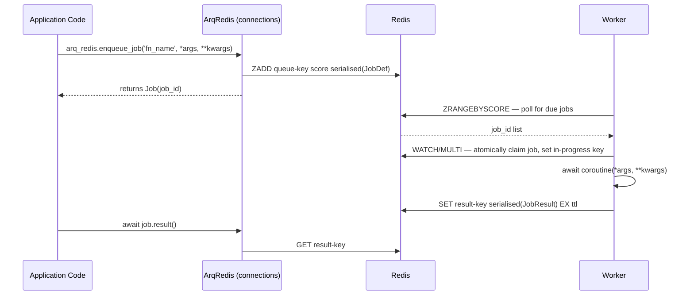

# Sequence: Enqueue and Execute a Job

```mermaid
sequenceDiagram
    participant developer as Application Code
    participant arq-client-connections as ArqRedis (connections)
    participant redis as Redis
    participant arq-worker-worker as Worker

    developer ->> arq-client-connections: arq_redis.enqueue_job('fn_name', *args, **kwargs)
    arq-client-connections ->> redis: ZADD queue-key score serialised(JobDef)
    arq-client-connections -->> developer: returns Job(job_id)
    arq-worker-worker ->> redis: ZRANGEBYSCORE — poll for due jobs
    redis -->> arq-worker-worker: job_id list
    arq-worker-worker ->> redis: WATCH/MULTI — atomically claim job, set in-progress key
    arq-worker-worker ->> arq-worker-worker: await coroutine(*args, **kwargs)
    arq-worker-worker ->> redis: SET result-key serialised(JobResult) EX ttl
    developer ->> arq-client-connections: await job.result()
    arq-client-connections ->> redis: GET result-key
```

**Source:** `.archeia/codebase/architecture/dataflow.json`
**Generated:** 2026-04-10
