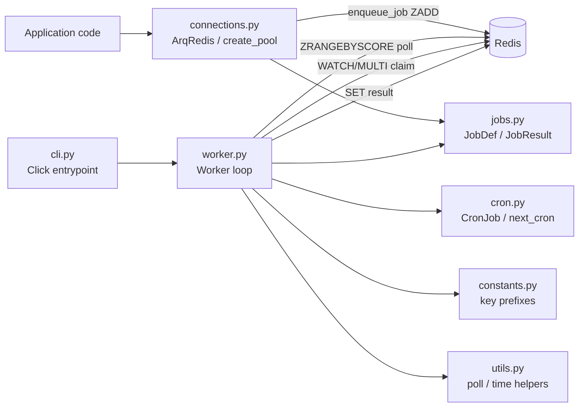

# arq

Core library package. Implements the full job queue: connection management, job lifecycle, worker execution loop, cron scheduling, and the CLI entrypoint.

## Structure

## Key Concepts

- **ArqRedis is a Redis subclass** — `connections.py` extends `redis.asyncio.Redis` to add `enqueue_job`. Do not bypass it to write to queue keys directly.
- **Sorted set as queue** — Jobs are stored in Redis sorted sets with score = UNIX timestamp milliseconds. Deferred jobs have a future score; due jobs score ≤ now.
- **Atomic claim via WATCH/MULTI** — `worker.py` uses Redis optimistic locking to claim a job exactly once across concurrent workers. Two workers polling simultaneously will not both execute the same job.
- **Pluggable serialisation** — Default is pickle; pass `job_serializer`/`job_deserializer` callables to `ArqRedis` (e.g., msgpack). Both the enqueuing client and the worker must use the same serialiser.
- **`constants.py` key prefixes are a shared contract** — `job_key_prefix`, `in_progress_key_prefix`, `result_key_prefix` etc. are used by both client and worker; changing them breaks in-flight jobs.

## Usage

`connections.py` is the public API for application code: `create_pool(RedisSettings(...))` returns an `ArqRedis` instance. `worker.py` exports `Worker`, `run_worker`, and `create_worker` for process lifecycle. `cli.py` wraps these for command-line invocation.

See [Guide.md](../.archeia/codebase/guide.md) for dev commands.

## Learnings

_Seed entry — append discoveries here as you work._
