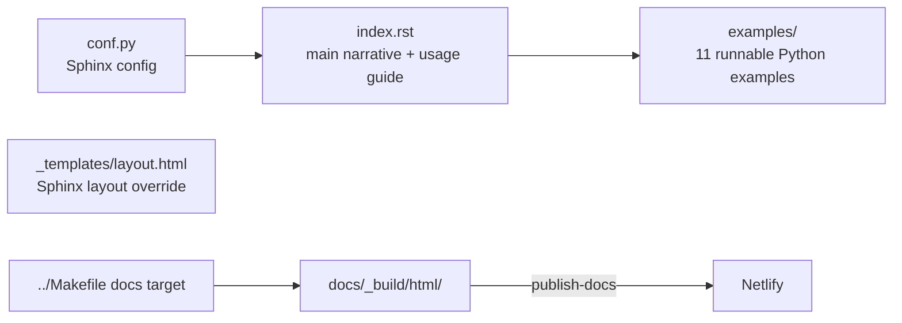

# docs

Sphinx documentation source for arq, published to [arq-docs.helpmanual.io](https://arq-docs.helpmanual.io) via Netlify on release.

## Structure



## Key Concepts

- **`index.rst` is the single documentation file** — all usage docs, configuration reference, and API docs live here. There is no multi-page structure beyond the examples directory.
- **`examples/` contains runnable scripts** — each file in `docs/examples/` is a self-contained Python script demonstrating a specific arq feature: job results, deferred execution, retries, cron, msgpack serialisation, job abort, job IDs, slow job output, and sync jobs.
- **Old docs preserved** — `old-docs.zip` is unpacked into `docs/_build/html/old/` by `make docs` to keep pre-v0.16 documentation accessible.
- **Published via Netlify** — `make publish-docs` zips `docs/_build/html/` and POSTs to Netlify API using the `NETLIFY` env var (token secret).

## Usage

```bash
make docs          # build HTML to docs/_build/html/
make publish-docs  # zip and deploy to Netlify (requires NETLIFY env var)
```

The `docs` CI job builds docs on every push and stores the output as a GitHub Actions artifact, which the `release` job downloads to publish on tag.

See [Guide.md](../.archeia/codebase/guide.md) for full setup.

## Learnings

_Seed entry — append discoveries here as you work._
