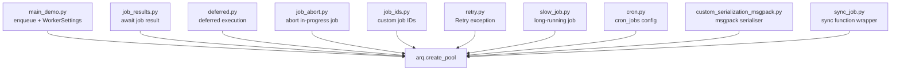

# docs/examples

Runnable Python scripts that demonstrate specific arq features. Each file is a self-contained example imported and referenced by the Sphinx docs in `docs/index.rst`.

## Structure

## Key Concepts

- **`WorkerSettings` pattern** — every example defines a `WorkerSettings` class with `functions`, optional `on_startup`/`on_shutdown` hooks, and `redis_settings`. This class is passed to the `arq` CLI as the importable settings object.
- **`ctx` dict for shared state** — startup hooks populate a `ctx` dict (e.g., HTTP session, DB connection) that is passed into every job coroutine as the first argument. Shutdown hooks close those resources.
- **Custom serialiser pattern** — `custom_serialization_msgpack.py` shows how to pass `job_serializer=msgpack.packb` and `job_deserializer=functools.partial(msgpack.unpackb, raw=False)` to `create_pool` and `Worker`. Both sides must use matching callables.
- **`slow_job_output.txt`** — Expected output file for `slow_job.py`, used for documentation output snippets.

## Usage

These examples are referenced by `docs/index.rst` (via Sphinx `.. literalinclude::` or similar directives) and serve as canonical usage patterns. They are not part of the test suite.

## Learnings

_Seed entry — append discoveries here as you work._
