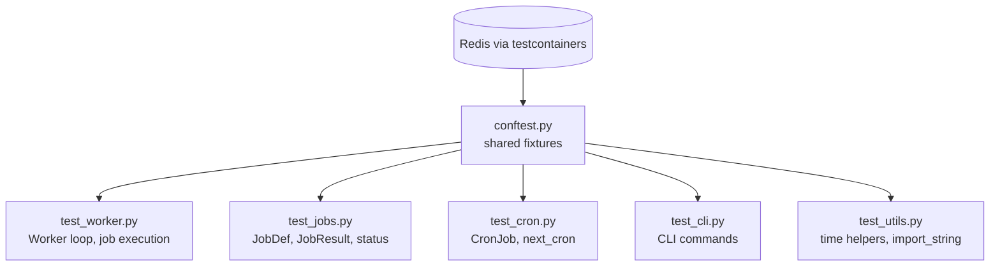

# tests

Pytest test suite for arq. One test file per core module: `test_worker.py`, `test_jobs.py`, `test_cron.py`, `test_cli.py`, `test_utils.py`, and `test_main.py`.

## Structure



## Key Concepts

- **Real Redis, no mocks** — `conftest.py` uses `testcontainers.redis.RedisContainer` to spin up an actual Redis instance. Tests rely on genuine Redis behaviour (WATCH/MULTI, TTL, sorted sets). Docker must be running.
- **Session-scoped Redis container** — The container starts once per test session, not per test. `arq_redis` fixture calls `flushall()` before each test to reset state.
- **`asyncio_mode = 'auto'`** — All `async def` test functions run automatically as coroutines via pytest-asyncio. No `@pytest.mark.asyncio` decorator needed.
- **Fixtures for common objects** — `arq_redis` (clean ArqRedis), `worker` (factory for `Worker` instances in burst mode), `worker_retry`, `create_pool`, `env` (env var setter/cleaner) — all in `conftest.py`.
- **Redis version matrix** — CI tests against Redis 5, 6, and 7. `ARQ_TEST_REDIS_VERSION` env var controls the container image tag.

## Usage

`conftest.py` fixtures are consumed by all test files. `test_worker.py` is the largest file (1,138 lines) and covers the full Worker lifecycle including health checks, cron scheduling, job retries, abort, and burst mode.

```bash
make test                        # run all tests with coverage
ARQ_TEST_REDIS_VERSION=7 make test  # test against Redis 7
```

See [Guide.md](../.archeia/codebase/guide.md) for full test command options.

## Learnings

_Seed entry — append discoveries here as you work._
