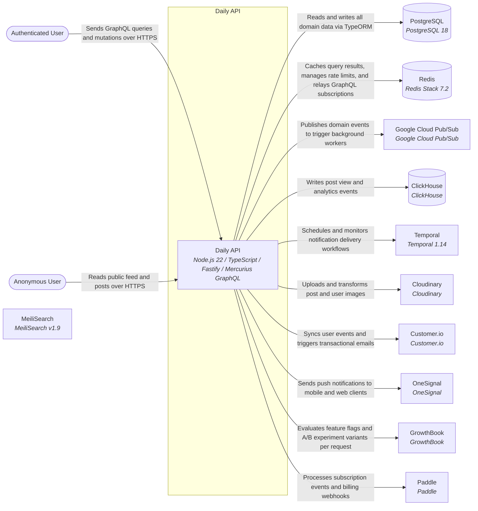

# System Context

```mermaid
flowchart LR
    authenticated-user([Authenticated User])
    anonymous-user([Anonymous User])

    subgraph boundary["Daily API"]
        daily-api["Daily API<br/><i>Node.js 22 / TypeScript / Fastify / Mercurius GraphQL</i>"]
    end

    postgresql[("PostgreSQL<br/><i>PostgreSQL 18</i>")]
    redis[("Redis<br/><i>Redis Stack 7.2</i>")]
    google-pubsub["Google Cloud Pub/Sub<br/><i>Google Cloud Pub/Sub</i>"]
    clickhouse[("ClickHouse<br/><i>ClickHouse</i>")]
    temporal["Temporal<br/><i>Temporal 1.14</i>"]
    cloudinary["Cloudinary<br/><i>Cloudinary</i>"]
    customer-io["Customer.io<br/><i>Customer.io</i>"]
    onesignal["OneSignal<br/><i>OneSignal</i>"]
    growthbook["GrowthBook<br/><i>GrowthBook</i>"]
    paddle["Paddle<br/><i>Paddle</i>"]
    meilisearch["MeiliSearch<br/><i>MeiliSearch v1.9</i>"]

    authenticated-user -->|"Sends GraphQL queries and mutations over HTTPS"| daily-api
    anonymous-user -->|"Reads public feed and posts over HTTPS"| daily-api
    daily-api -->|"Reads and writes all domain data via TypeORM"| postgresql
    daily-api -->|"Caches query results, manages rate limits, and relays GraphQL subscriptions"| redis
    daily-api -->|"Publishes domain events to trigger background workers"| google-pubsub
    daily-api -->|"Writes post view and analytics events"| clickhouse
    daily-api -->|"Schedules and monitors notification delivery workflows"| temporal
    daily-api -->|"Uploads and transforms post and user images"| cloudinary
    daily-api -->|"Syncs user events and triggers transactional emails"| customer-io
    daily-api -->|"Sends push notifications to mobile and web clients"| onesignal
    daily-api -->|"Evaluates feature flags and A/B experiment variants per request"| growthbook
    daily-api -->|"Processes subscription events and billing webhooks"| paddle
```

**Source:** `.archeia/codebase/architecture/system.json`
**Generated:** 2026-04-10
