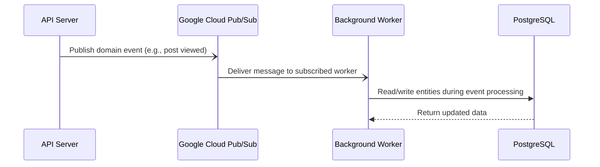

# Background Event Processing

```mermaid
sequenceDiagram
    participant api-server as API Server
    participant google-pubsub as Google Cloud Pub/Sub
    participant background-worker as Background Worker
    participant postgresql as PostgreSQL

    api-server -) google-pubsub: Publish domain event (e.g., post viewed)
    google-pubsub -) background-worker: Deliver message to subscribed worker
    background-worker ->> postgresql: Read/write entities during event processing
    postgresql -->> background-worker: Return updated data
```

**Source:** `.archeia/codebase/architecture/dataflow.json`
**Generated:** 2026-04-10
