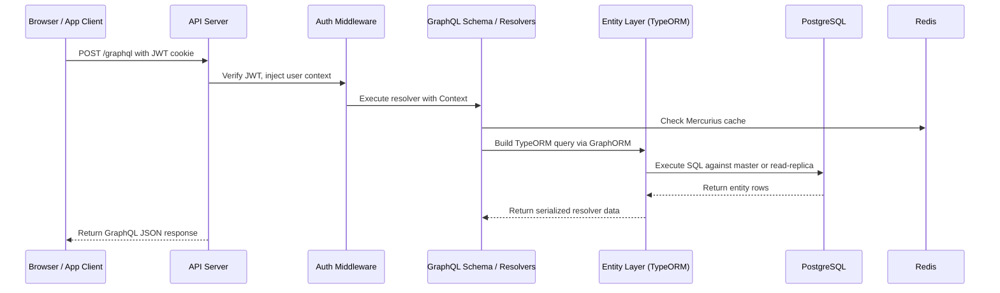

# GraphQL Query Request (Primary Flow)

```mermaid
sequenceDiagram
    participant authenticated-user as Browser / App Client
    participant api-server as API Server
    participant api-auth as Auth Middleware
    participant api-graphql as GraphQL Schema / Resolvers
    participant api-entity as Entity Layer (TypeORM)
    participant postgresql as PostgreSQL
    participant redis as Redis

    authenticated-user ->> api-server: POST /graphql with JWT cookie
    api-server ->> api-auth: Verify JWT, inject user context
    api-auth ->> api-graphql: Execute resolver with Context
    api-graphql ->> redis: Check Mercurius cache
    api-graphql ->> api-entity: Build TypeORM query via GraphORM
    api-entity ->> postgresql: Execute SQL against master or read-replica
    postgresql -->> api-entity: Return entity rows
    api-entity -->> api-graphql: Return serialized resolver data
    api-server -->> authenticated-user: Return GraphQL JSON response
```

**Source:** `.archeia/codebase/architecture/dataflow.json`
**Generated:** 2026-04-10
