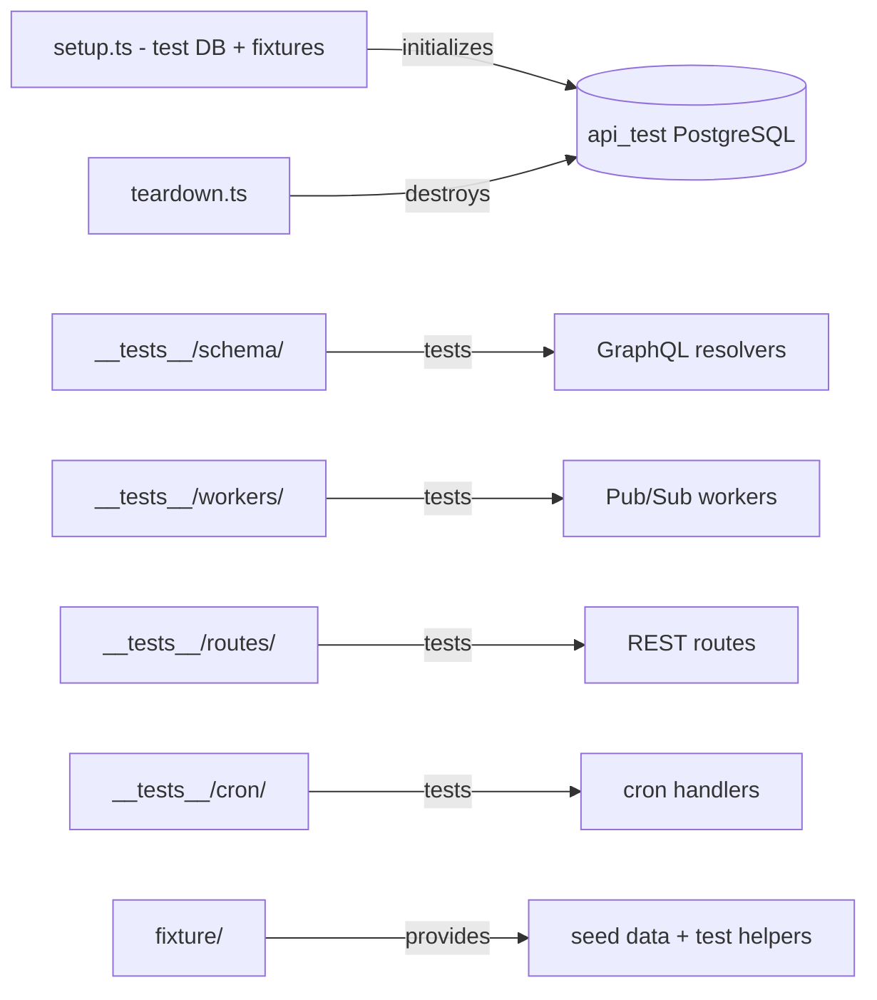

# `__tests__`

Jest integration tests for the daily.dev API. Tests run against a real PostgreSQL database (`api_test`) with all migrations applied. The directory structure mirrors `src/` — `__tests__/schema/` tests resolvers, `__tests__/workers/` tests Pub/Sub handlers, etc.

## Structure

## Key Concepts

- **Real database, no mocks** — tests use a live PostgreSQL connection reset via `pnpm run pretest` (`db:migrate:reset`). No in-memory database.
- **Setup and teardown** — `setup.ts` runs before each file (jest `setupFilesAfterEnv`); `teardown.ts` runs once globally after all tests.
- **Fixture helpers** — `fixture/` contains JSON seed data and TypeScript helper functions (e.g., `createUser`, `createPost`) used across test files. Do not duplicate fixture logic — extend existing helpers.
- **`TZ=UTC` forced** — all tests run with UTC timezone set via `jest.config.js`. Timezone-sensitive assertions must account for this.
- **Serial execution** — tests run `--runInBand` (no parallel workers). This avoids DB contention but makes the suite slower.
- **Type errors suppressed** — `ts-jest` diagnostics are disabled during test runs. Type issues appear at build time, not during `pnpm test`.

## Usage

Run with `pnpm run test`. The `pretest` hook resets the database automatically. Individual test files can be run with `jest --testPathPattern=<pattern>`.

**Evidence:** `jest.config.js`, `package.json`

## Learnings

- No entries yet — add testing discoveries here as you work.
