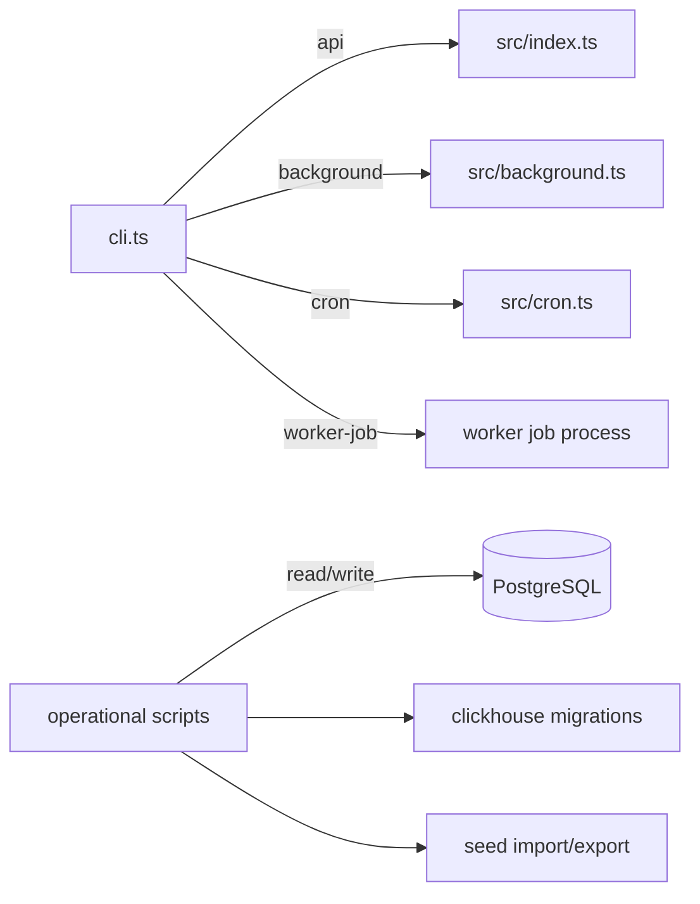

# bin

CLI entry points and one-off operational scripts. The primary entry point is `cli.ts`, which dispatches to the API server, background worker, cron runner, or Temporal worker. The remaining files are data migration, backfill, seeding, and administrative scripts.

## Structure

## Key Concepts

- **`cli.ts` is the main dispatcher** — all `pnpm run dev:*` and `pnpm run start:*` scripts route through `bin/cli.ts`, which selects the process to start.
- **One-off scripts** — files like `addDisallowHandles.ts`, `backfillToolIcons.ts`, `syncSourceMembers.ts` are run manually for data fixes. They are not part of normal deployments.
- **ClickHouse migrations** — `runClickhouseMigrations.ts` and `createClickhouseMigration.ts` manage the ClickHouse analytics schema separately from TypeORM migrations.
- **`common.ts`** — shared CLI helpers (database connection setup, logging) imported by most operational scripts.

## Usage

Run via pnpm scripts defined in `package.json`. One-off scripts are run directly with `ts-node bin/scriptName.ts`. Do not add business logic to bin scripts — they should be thin wrappers that delegate to `src/`.

**Evidence:** `package.json`, `bin/cli.ts`

## Learnings

- No entries yet — add bin script discoveries here as you work.
