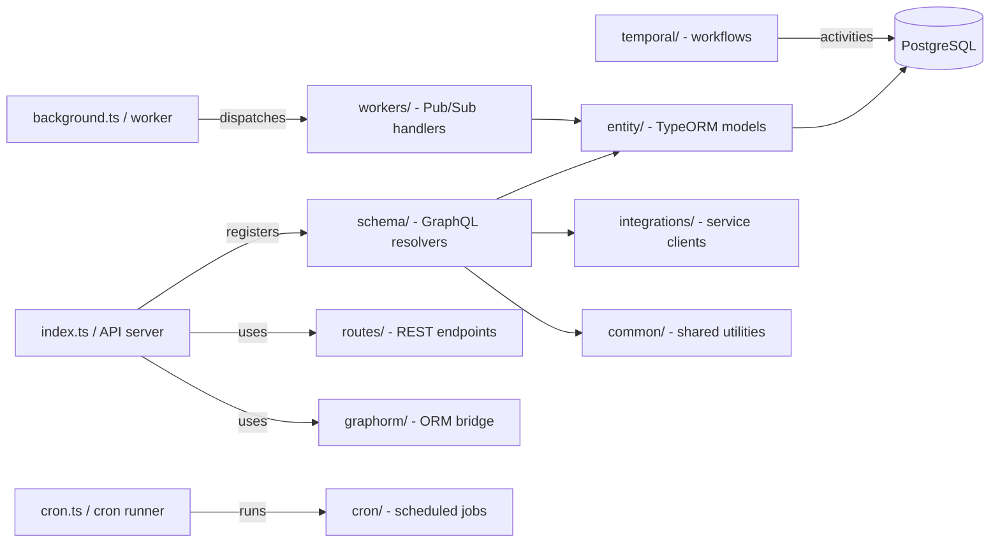

# src

TypeScript source for the daily.dev API — a Fastify + Mercurius GraphQL service, background Pub/Sub processor, scheduled cron runner, and Temporal workflow worker. All four processes share entities, workers, and common utilities from this directory.

## Structure

## Key Concepts

- **Four processes, one codebase** — `src/index.ts` (API), `src/background.ts` (worker), `src/cron.ts` (cron), and `src/temporal/` (Temporal) are separate entry points that share all entities and common modules.
- **GraphORM bridge** — `src/graphorm/` translates GraphQL field selections into TypeORM queries, preventing N+1 fetches in resolvers.
- **Table inheritance** — `Post` and `Source` use TypeORM `@TableInheritance` to discriminate subtypes (Article, Share, Squad, etc.) via a `type` column.
- **Pub/Sub event bus** — workers in `src/workers/` subscribe to Google Cloud Pub/Sub topics; the API publishes events after mutations.
- **No raw SQL** — use TypeORM repository methods or query builder. Raw `con.query()` requires explicit justification.

## Usage

`schema/` imports from `entity/` for all data access. `workers/` share entity definitions with `schema/`. `common/` provides feed building, pagination, Pub/Sub helpers, and mailing utilities consumed across all modules.

**Evidence:** `src/index.ts`, `src/background.ts`, `src/entity/index.ts`, `src/workers/index.ts`

## Learnings

- No entries yet — add domain discoveries here as you work.
