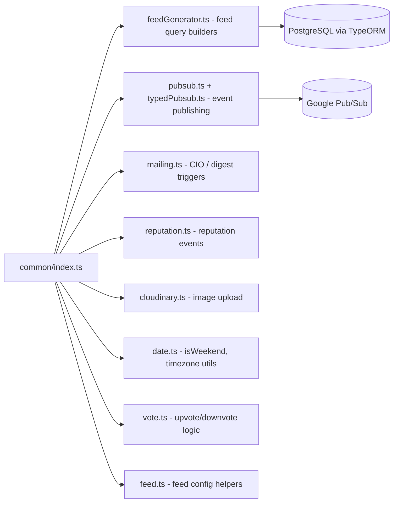

# common

Shared utilities consumed across schema resolvers, workers, cron jobs, and routes. Covers feed building, pagination, Pub/Sub helpers, mailing, reputation, cloudinary, date utilities, and typed protobuf message definitions.

## Structure

## Key Concepts

- **Import `isWeekend` from `src/common`, not `date-fns`** — ESLint enforces this restriction (`no-restricted-imports`). The common wrapper adds timezone-aware behavior.
- **Feed builder functions** — `anonymousFeedBuilder`, `configuredFeedBuilder`, `sourceFeedBuilder`, `tagFeedBuilder`, and others in `feedGenerator.ts` return TypeORM `SelectQueryBuilder` instances that `feeds.ts` resolvers use directly.
- **Typed Pub/Sub** — `typedPubsub.ts` wraps `@google-cloud/pubsub` with message type schemas. Use `publishTypedMessage()` for structured events; `pubsub.ts` is for legacy untyped messages.
- **Personalized digest** — `personalizedDigest.ts` contains scheduling and trigger helpers called from cron jobs and digest workers.

## Usage

Exported from `src/common/index.ts` and imported widely across `src/schema/`, `src/workers/`, and `src/cron/`. This is the primary shared utility layer — if a helper is needed in more than one module, it goes here.

**Evidence:** `src/common/index.ts`, `.eslintrc.js`

## Learnings

- No entries yet — add common utility discoveries here as you work.
