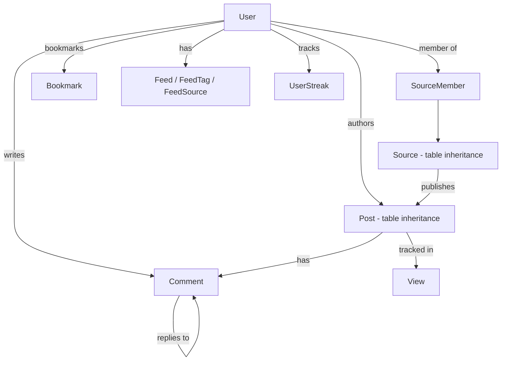

# entity

TypeORM entity definitions for all daily.dev domain objects — posts, users, sources (squads), comments, feeds, bookmarks, notifications, and more. This is the shared data layer used by GraphQL resolvers, Pub/Sub workers, cron jobs, and Temporal activities.

## Structure

## Key Concepts

- **Post table inheritance** — `Post` base entity with `@TableInheritance` by `type` column. Subtypes: `ArticlePost`, `SharePost`, `FreeformPost`, `WelcomePost`, `CollectionPost`, `YouTubePost`, `SocialTwitterPost`. Use `@ChildEntity()` for subtype-specific columns.
- **Source table inheritance** — `Source` discriminates Machine, Squad, and User source types the same way.
- **JSONB flags pattern** — many entities use a typed `flags: Partial<{...}>` JSONB column for optional feature-specific metadata (e.g., `PostFlags`, `UserFlags`, `SourceFlagsPublic`). Always use the exported type, never raw JSONB keys.
- **UUID vs. text IDs** — User IDs are `varchar(36)` (UUID-like). Post IDs are `text` (external IDs from crawlers). Comment IDs are `varchar(14)` (nanoid). Do not assume ID format across entity types.
- **Lazy relations** — most relations are declared with `lazy: true` and return `Promise<T>`. Await them explicitly or use GraphORM to load them via field selection.

## Usage

Exported from `src/entity/index.ts` and consumed throughout `src/schema/` (resolvers), `src/workers/` (event handlers), and `src/cron/` (scheduled jobs). Migration files in `src/migration/` track all schema changes.

**Evidence:** `src/entity/index.ts`, `src/entity/posts/Post.ts`, `src/entity/Source.ts`, `src/entity/Comment.ts`

## Learnings

- No entries yet — add entity-specific discoveries here as you work.
