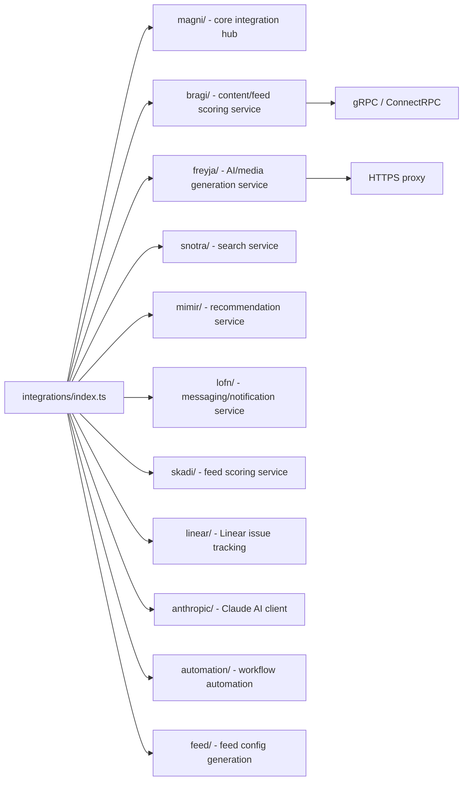

# integrations

Typed client wrappers for daily.dev internal microservices and external APIs consumed by GraphQL resolvers and workers. Each subdirectory encapsulates communication with one upstream service.

## Structure

## Key Concepts

- **gRPC via ConnectRPC** — most internal service clients use `@connectrpc/connect` with `@connectrpc/connect-node` for type-safe gRPC communication. Client stubs are generated from proto definitions in `@dailydotdev/schema`.
- **Named internal services** — services use Norse mythology names: bragi (content), freyja (AI/media), snotra (search), mimir (recommendations), lofn (messaging), skadi (feed), magni (aggregation).
- **Feed integration** — `feed/` generates feed configuration payloads sent to the feed scoring service. `FeedGenerator` and `FeedConfigName` types define the available feed strategies.
- **Anthropic** — `anthropic/` wraps Claude for AI-generated content features (briefs, summaries).

## Usage

`src/schema/feeds.ts` imports feed generators from `src/integrations/feed/`. GraphQL resolvers import specific service clients as needed. Workers use integration clients for notification and content enrichment.

**Evidence:** `src/integrations/index.ts`, `src/integrations/bragi/clients.ts`, `package.json`

## Learnings

- No entries yet — add integration-specific discoveries here as you work.
