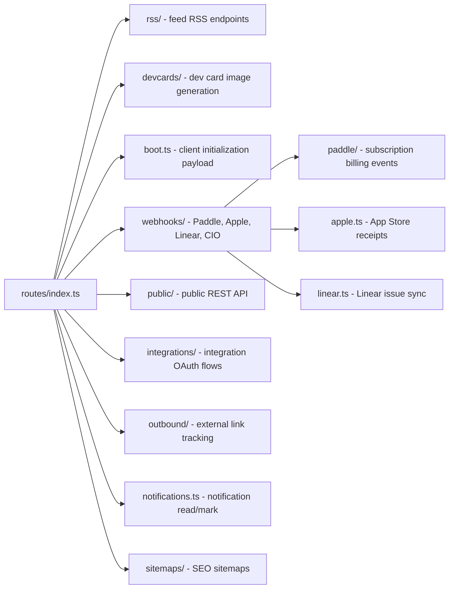

# routes

Fastify REST route handlers registered on the API server. Covers RSS feeds, devcards, user boot endpoint, webhook receivers (Paddle, Apple, Linear, Customer.io), redirects, notifications, public API, and local ad serving.

## Structure

## Key Concepts

- **Route prefixes** — each route group is registered with a prefix in `routes/index.ts` (e.g., `/rss`, `/devcards`, `/p` for private, `/r` for redirects, `/api` for public).
- **Boot endpoint** — `boot.ts` returns the full client initialization payload (user, settings, alerts, features) in a single request to minimize client round-trips.
- **Webhooks are raw-body enabled** — the webhook handlers require `rawBody` for signature verification (Paddle, Apple). The main app registers `fastify-raw-body` globally with `global: false`, so individual webhook routes opt in.
- **Private routes** — `privateRoutes` at `/p` are conditionally registered only when `ENABLE_PRIVATE_ROUTES=true`. These are internal service-to-service endpoints.
- **Public API** — `public/` exposes a stable REST API at `/api` prefix for external consumers.

## Usage

All routes are imported and registered in `src/routes/index.ts`, which is loaded by `src/index.ts` at the root prefix. Webhook handlers talk to entity layer and Pub/Sub. Boot endpoint aggregates from multiple entity queries.

**Evidence:** `src/routes/index.ts`, `src/index.ts`

## Learnings

- No entries yet — add route-specific discoveries here as you work.
