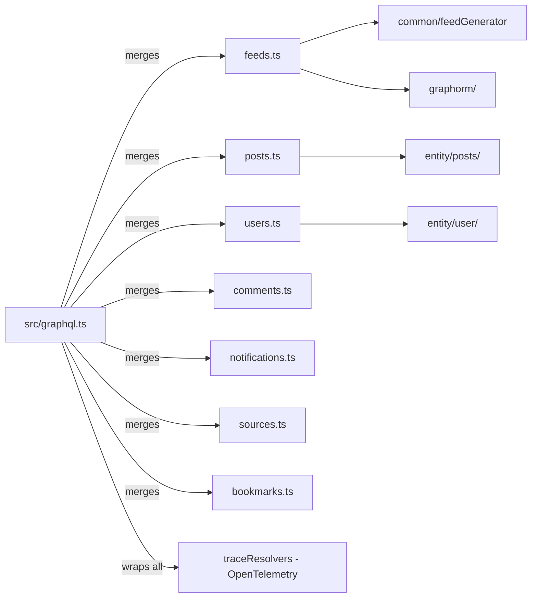

# schema

GraphQL type definitions and resolver implementations organized by domain. Each file defines the SDL types and the corresponding resolvers for one feature area (feeds, posts, users, comments, notifications, etc.). Loaded and merged in `src/graphql.ts`.

## Structure

## Key Concepts

- **Do not call `traceResolvers` directly** — it is applied centrally in `src/graphql.ts`. ESLint enforces this (`no-restricted-imports` in `src/schema/*.ts`).
- **Feed resolvers use feedGenerators** — `feeds.ts` delegates to `feedGenerators` map from `src/integrations/feed/` for personalized, anonymous, source, tag, and keyword feeds. Feed cursor pagination uses base64-encoded cursors.
- **GraphORM for queries** — resolvers use `graphorm` (from `src/graphorm/`) to build TypeORM queries from the GraphQL field selection set, avoiding N+1 fetches.
- **GQLPost / GQLUser / GQLSource** — reusable GraphQL output types shared across schema files via named exports.
- **Pagination** — `feedCursorPageGenerator` and `offsetPageGenerator` from `schema/common.ts` handle cursor-based and offset pagination respectively.

## Usage

All schema files are merged in `src/graphql.ts` to build the final GraphQL schema. The Mercurius engine in `src/index.ts` serves this schema. Tests in `__tests__/schema/` test resolvers against a live database.

**Evidence:** `src/schema/feeds.ts`, `src/graphql.ts`, `src/graphorm/index.ts`

## Learnings

- No entries yet — add resolver-specific discoveries here as you work.
