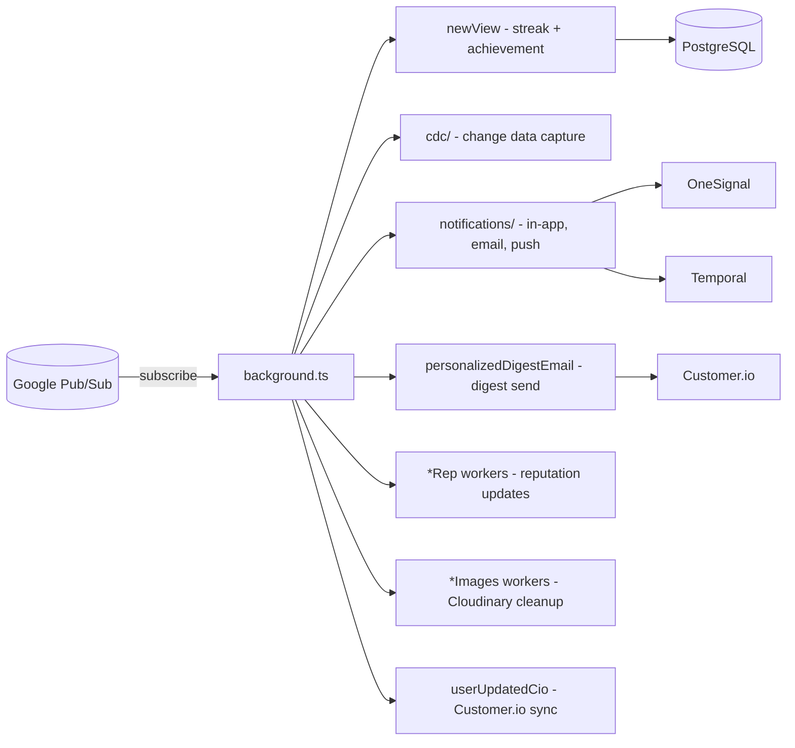

# workers

Google Cloud Pub/Sub message handlers for background event processing. Each worker subscribes to one topic and processes a single event type — reputation changes, CDC replication, notification dispatch, digest emails, image cleanup, user sync, and more. Workers run in the `background.ts` process.

## Structure

## Key Concepts

- **One worker, one topic** — each `.ts` file handles a single Pub/Sub subscription. Workers are registered in `src/workers/index.ts` as `workers[]` (raw JSON) or `typedWorkers[]` (parsed via schema).
- **Typed workers vs. untyped** — `typedWorkers` use `worker.parseMessage` to decode structured protobuf or JSON messages. Untyped workers receive raw `message.data` as JSON via `messageToJson()`.
- **CDC workers** — `cdc/primary.ts` and `cdc/notifications.ts` handle Postgres change-data-capture events for cross-service replication.
- **newView** — the most complex single worker: records `View`, updates `UserStreak` (with fibonacci-based milestone logic), clears Redis cache keys, and triggers brief-read achievement checks.
- **Notification workers** — `notifications/` subdirectory contains specialized handlers for each notification type; they publish to Temporal or call OneSignal/CIO directly.

## Usage

All workers are imported and registered in `src/workers/index.ts`. The `background.ts` process iterates `workers` and `typedWorkers` arrays and calls `workerSubscribe()` for each. Workers share entity definitions from `src/entity/`.

**Evidence:** `src/workers/index.ts`, `src/background.ts`, `src/workers/newView.ts`

## Learnings

- No entries yet — add worker-specific discoveries here as you work.
