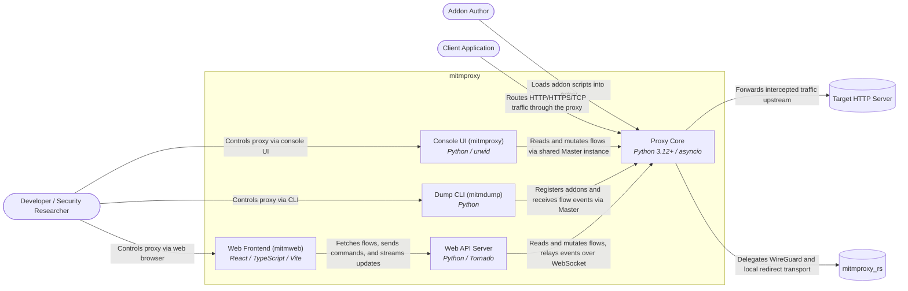

# Container Diagram

```mermaid
flowchart LR
    developer(["Developer / Security Researcher"])
    addon-author(["Addon Author"])
    client-application(["Client Application"])
    target-server[("Target HTTP Server")]
    mitmproxy-rs[("mitmproxy_rs")]

    subgraph boundary["mitmproxy"]
        proxy-core["Proxy Core<br/><i>Python 3.12+ / asyncio</i>"]
        console-ui["Console UI (mitmproxy)<br/><i>Python / urwid</i>"]
        dump-ui["Dump CLI (mitmdump)<br/><i>Python</i>"]
        web-backend["Web API Server<br/><i>Python / Tornado</i>"]
        web-frontend["Web Frontend (mitmweb)<br/><i>React / TypeScript / Vite</i>"]
    end

    developer -->|"Controls proxy via console UI"| console-ui
    developer -->|"Controls proxy via CLI"| dump-ui
    developer -->|"Controls proxy via web browser"| web-frontend
    addon-author -->|"Loads addon scripts into proxy"| proxy-core
    client-application -->|"Routes HTTP/HTTPS/TCP traffic through the proxy"| proxy-core
    proxy-core -->|"Forwards intercepted traffic upstream"| target-server
    proxy-core -->|"Delegates WireGuard and local redirect transport"| mitmproxy-rs
    console-ui -->|"Reads and mutates flows via shared Master instance"| proxy-core
    dump-ui -->|"Registers addons and receives flow events via Master"| proxy-core
    web-backend -->|"Reads and mutates flows, relays events over WebSocket"| proxy-core
    web-frontend -->|"Fetches flows, sends commands, and streams updates"| web-backend
```

**Source:** `.archeia/codebase/architecture/containers.json`
**Generated:** 2026-04-10
