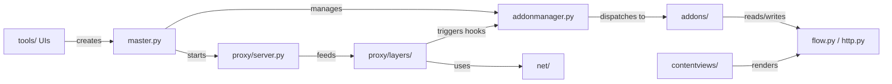

# mitmproxy (core package)

The Python package implementing the intercepting proxy: flow model, addon system, asyncio event loop, protocol layer pipeline, content rendering, three user interfaces, and network primitives.

## Structure

## Key Concepts

- **Flow** — the central domain object (`flow.py`, `http.py`, `dns.py`, `tcp.py`, `udp.py`). An `HTTPFlow` wraps a request/response pair with client/server connection metadata and lifecycle state (`created → ended`).
- **AddonManager** — the hook dispatch engine (`addonmanager.py`). Addons register hook methods matching event names exactly (`def request(self, flow)`). Hooks are triggered synchronously and can mutate or intercept flows.
- **Master** — the asyncio event loop coordinator (`master.py`). Creates the addon manager, starts the proxy server, and drives `running()` / `done()` lifecycle. Central reference via `mitmproxy.ctx`.
- **Protocol Layers** — stateful generators in `proxy/layers/` that process raw bytes into protocol events and yield commands. Each connection gets a stack of layers (TLS → HTTP → WebSocket etc.) determined by the detected protocol.
- **Options / OptManager** — shared typed configuration store (`options.py`, `optmanager.py`). Addons subscribe to option changes via `configure(updated)`.

## Usage

This package is the importable library. `mitmproxy.tools.main` wires up Master + addons + a UI. `examples/addons/` shows how to load custom addons with `-s`. The `mitmproxy.io` subpackage handles flow serialization for `mitmdump -w/-r`.

**Evidence:** `mitmproxy/master.py`, `mitmproxy/addonmanager.py`, `mitmproxy/flow.py`

## Learnings

<!-- Add learnings here as you work in this directory. -->
