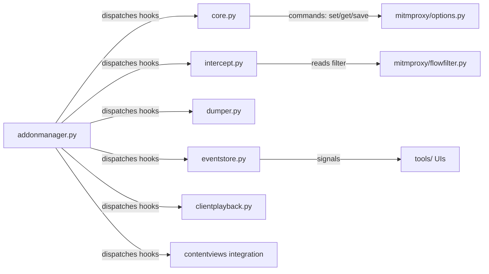

# addons

Built-in addon implementations that ship with mitmproxy. Each file is a self-contained addon class that hooks into the request/response lifecycle to provide a specific proxy behavior.

## Structure

## Key Concepts

- **One addon = one file** — each `.py` exports a single class implementing hook methods. `core.py` registers the `set`, `get`, `save`, `resume`, `kill` commands. `intercept.py` applies `flowfilter` expressions to pause flows.
- **EventStore** — `eventstore.py` maintains a ring buffer (10,000 entries) of log entries and fires `sig_add` / `sig_refresh` signals. The console and web UIs subscribe to these signals to update their log views.
- **ClientPlayback** — `clientplayback.py` replays saved flows; it reads from `mitmproxy/io/` and re-drives them through the addon pipeline.
- **Dumper** — `dumper.py` renders flows to stdout/file using `contentviews` for body rendering. Used by `mitmdump`.
- **ProxyServer** — `proxyserver.py` is the addon that wraps `mitmproxy/proxy/mode_servers.py` and manages server lifecycle via `Master`.

## Usage

All addons in this directory are registered by default in every mitmproxy interface. Custom addons (user scripts) are loaded separately via `-s`. Do not import from this directory in tests without going through `AddonManager`.

**Evidence:** `mitmproxy/addons/core.py`, `mitmproxy/addons/intercept.py`, `mitmproxy/addons/eventstore.py`, `mitmproxy/addonmanager.py`

## Learnings

<!-- Add learnings here as you work in this directory. -->
