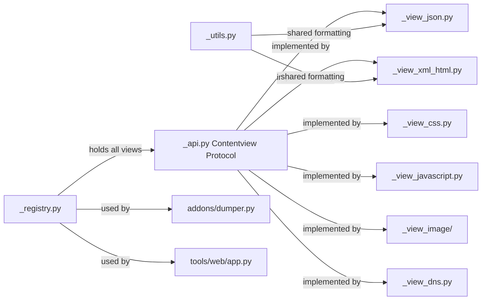

# contentviews

Content rendering subsystem: converts raw HTTP/WebSocket/TCP/DNS body bytes into human-readable text with optional syntax highlighting. Used by the console UI, web UI (mitmweb), and `mitmdump`.

## Structure

## Key Concepts

- **`Contentview` Protocol** — defined in `_api.py`. A view implements `prettify(data, ...)` returning `(text, syntax_highlight)`. Views receive the full flow context to detect content type from headers, not just raw bytes.
- **Registry** — `_registry.py` holds all registered views. `get_content_view(viewname, ...)` selects the appropriate view based on name, content-type header, and fallback chain.
- **`SyntaxHighlight` literal type** — one of `css | javascript | xml | yaml | none | error`. Returned by each view to tell the UI which highlighter to apply.
- **Image view** — `_view_image/` handles image parsing and metadata extraction (EXIF, dimensions). Distinct from text views: returns a description string rather than raw text.

## Usage

`addons/dumper.py` and `tools/web/app.py` call `_registry.get_content_view(...)`. To add a new content type, implement the `Contentview` protocol and register in `_registry.py`.

**Evidence:** `mitmproxy/contentviews/_api.py`, `mitmproxy/contentviews/_registry.py`

## Learnings

<!-- Add learnings here as you work in this directory. -->
