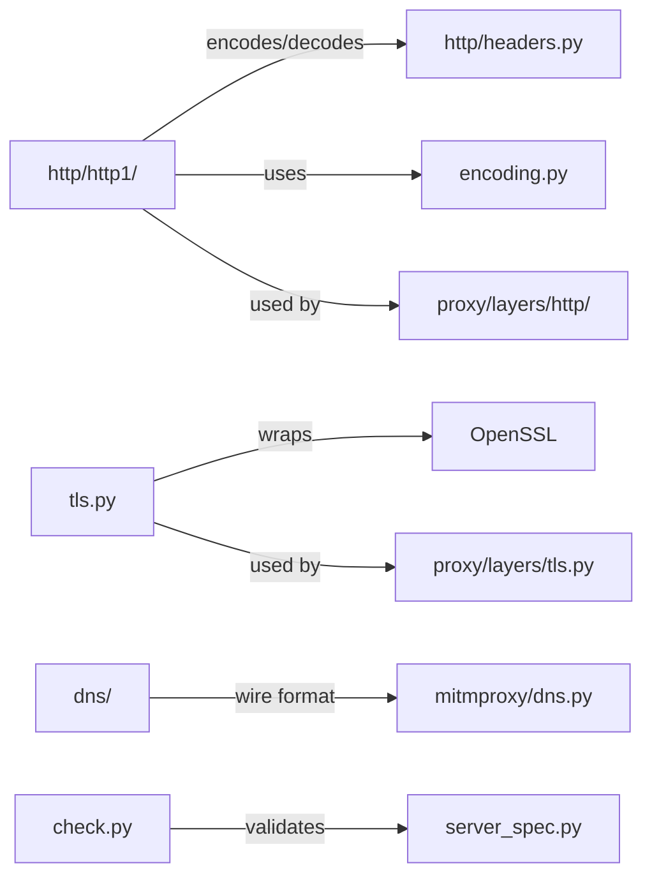

# net

Low-level network protocol primitives: HTTP/1 codec, HTTP headers and cookies, TLS client/server setup, DNS wire format, URL parsing, and connection utilities. These are pure protocol building blocks — no asyncio, no addon system.

## Structure

## Key Concepts

- **`http/http1/`** — HTTP/1.0 and HTTP/1.1 request/response codec. Stateless functions for reading/writing HTTP messages from/to byte streams. Used directly by the proxy layer pipeline.
- **`http/headers.py`** — `Headers` is a case-insensitive multi-value dict that preserves original byte casing. Critical for proxy correctness — do not convert header names to strings naively.
- **`tls.py`** — TLS handshake helpers and certificate verification. Distinct from `mitmproxy/certs.py` (which manages the mitmproxy CA). `net/tls.py` wraps `pyOpenSSL` for actual connection setup.
- **`dns/`** — DNS wire format parsing and serialization for the DNS proxy mode.
- **`encoding.py`** — HTTP content-encoding decoders (gzip, brotli, zstd, deflate). Called by `contentviews` and `addons/anticomp.py`.

## Usage

Imported by `mitmproxy/proxy/layers/` for protocol handling. Also imported by `mitmproxy/net/http/` utilities like `check.py` and `server_spec.py` for host validation and server address parsing.

**Evidence:** `mitmproxy/net/http/`, `mitmproxy/net/tls.py`, `mitmproxy/proxy/server.py`

## Learnings

<!-- Add learnings here as you work in this directory. -->
