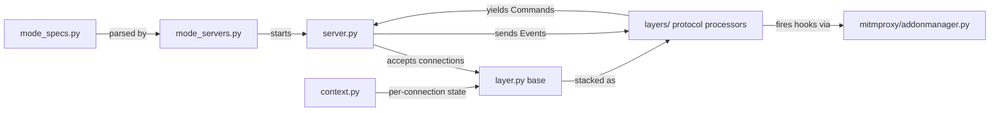

# proxy

asyncio proxy server and protocol layer pipeline. Accepts TCP connections from clients, determines the protocol stack for each connection, and drives a layered state machine that processes bytes into flow events and dispatches addon hooks.

## Structure

## Key Concepts

- **Layer / CommandGenerator pattern** — `layer.py` defines the `Layer` base class. Layers are Python generators that yield `Command` objects (e.g., `OpenConnection`, `SendData`, `Hook`) and receive `Event` objects. The server drives the generator by sending events and executing returned commands. This makes layers fully testable without asyncio.
- **`Context`** — per-connection object (`context.py`) holding client/server connection state, TLS status, and the current options snapshot. Passed to every layer.
- **Layer stacking** — `layers/modes.py` selects the layer stack based on proxy mode (transparent, explicit, SOCKS, reverse, upstream). A typical HTTPS connection: `ClientTLS → ServerTLS → HTTP`.
- **`mode_specs.py` / `mode_servers.py`** — proxy mode configuration (e.g., `regular`, `transparent`, `reverse:https://example.com`, `wireguard`) is parsed in `mode_specs.py` and the corresponding asyncio server started in `mode_servers.py`.
- **`server_hooks.py`** — hook dataclasses for proxy-level events (server connection established/failed, client connected/disconnected).

## Usage

`Master` starts the proxy via the `ProxyServer` addon (`addons/proxyserver.py`), which calls `mode_servers.py`. The proxy server, layers, and context are internal to the proxy subsystem — addons interact only through hook events, never by importing from `mitmproxy/proxy/` directly.

**Evidence:** `mitmproxy/proxy/server.py`, `mitmproxy/proxy/layer.py`, `mitmproxy/proxy/context.py`, `mitmproxy/master.py`

## Learnings

<!-- Add learnings here as you work in this directory. -->
