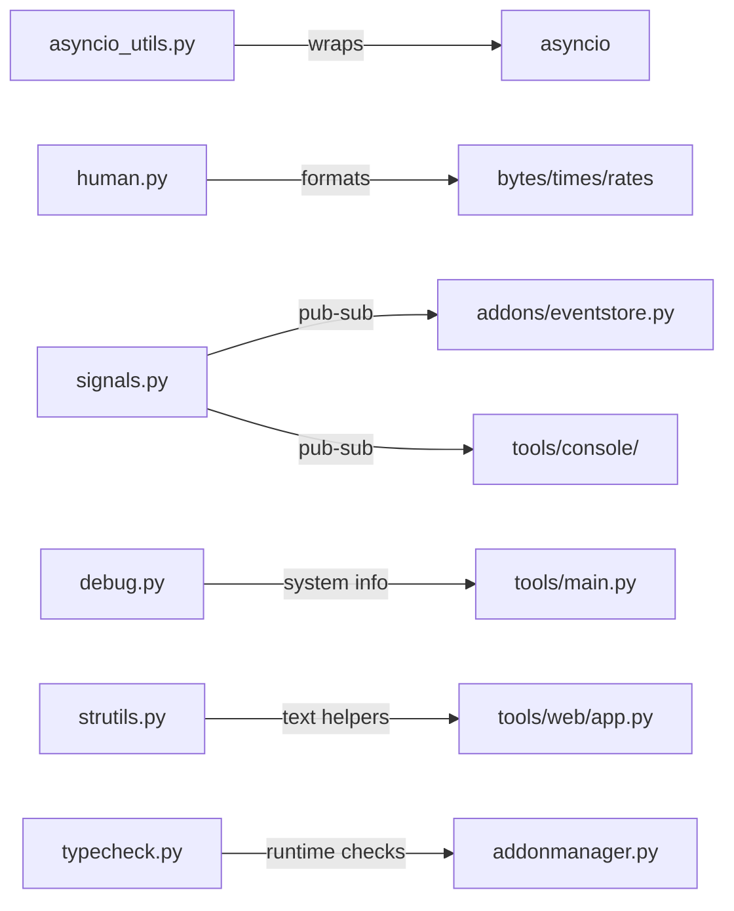

# utils

Shared utility modules used across the mitmproxy package. No addon system dependency — safe to import anywhere in the codebase.

## Structure

## Key Concepts

- **`asyncio_utils.create_task`** — wrapper around `asyncio.create_task` that keeps a strong reference to prevent garbage collection of running tasks. **Always use this instead of `asyncio.create_task` directly** — the TID251 lint rule enforces this.
- **`signals.py`** — lightweight synchronous pub-sub (`SyncSignal`). Used by `EventStore` to notify UIs of new log entries without coupling addons to UI implementations.
- **`human.py`** — formats bytes, durations, and rates as human-readable strings (e.g., `1.2 MB`, `3.4 s`). Used for flow size display in all UIs.
- **`strutils.py`** — `always_str`, `always_bytes`, `cut_after_n_lines`, and similar text coercion helpers. Used heavily in `tools/web/app.py` for response serialization.
- **`typecheck.py`** — runtime type checking utilities for addon hook argument validation in `addonmanager.py`.

## Usage

Imported across `mitmproxy/addons/`, `mitmproxy/proxy/`, and `mitmproxy/tools/`. Do not add addon-system or UI dependencies here — `utils/` must remain a leaf package.

**Evidence:** `mitmproxy/utils/asyncio_utils.py`, `mitmproxy/utils/signals.py`, `mitmproxy/utils/strutils.py`, `pyproject.toml`

## Learnings

<!-- Add learnings here as you work in this directory. -->
