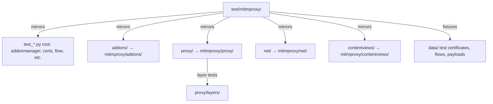

# test/mitmproxy

pytest test suite for the `mitmproxy` Python package. Mirrors the source structure: every subdirectory here maps directly to the corresponding package under `mitmproxy/`.

## Structure

## Key Concepts

- **Mirror structure** — `test/mitmproxy/addons/test_anticache.py` tests `mitmproxy/addons/anticache.py`. The CI `filename_matching` tox environment enforces this mapping.
- **`data/`** — test fixtures: TLS certificates, saved flow files, image files for contentview testing. Do not regenerate certificates without updating all tests that reference them.
- **Async test pattern** — use `@pytest.mark.asyncio` and `async def test_...()`. The `pytest-asyncio` plugin handles event loop setup. Do not mix sync and async in the same test function.
- **`proxy/conftest.py`** — shared fixtures for proxy layer tests. Provides `Playbook` and `Placeholder` helpers for the command/event generator pattern.
- **Individual coverage** — `tox -e individual_coverage` verifies that each source file has a corresponding test file. When adding a new source file, add the corresponding test file.

## Usage

Run targeted: `uv run pytest test/mitmproxy/addons/test_anticache.py --cov mitmproxy.addons.anticache`. Run all: `uv run tox -e py`. See `CONTRIBUTING.md` for full instructions.

**Evidence:** `test/mitmproxy/`, `CONTRIBUTING.md`, `pyproject.toml`

## Learnings

<!-- Add learnings here as you work in this directory. -->
