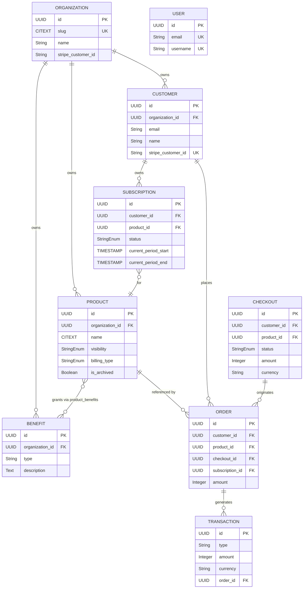

# Entity-Relationship Diagram

```mermaid
erDiagram
    ORGANIZATION ||--o{ PRODUCT : "owns"
    ORGANIZATION ||--o{ CUSTOMER : "owns"
    ORGANIZATION ||--o{ BENEFIT : "owns"
    PRODUCT ||--o{ ORDER : "referenced by"
    PRODUCT }o--o{ BENEFIT : "grants via product_benefits"
    CUSTOMER ||--o{ ORDER : "places"
    CUSTOMER ||--o{ SUBSCRIPTION : "owns"
    CHECKOUT ||--o{ ORDER : "originates"
    SUBSCRIPTION }o--|| PRODUCT : "for"
    ORDER ||--o{ TRANSACTION : "generates"

    ORGANIZATION {
        UUID id PK
        CITEXT slug UK
        String name
        String stripe_customer_id
    }
    PRODUCT {
        UUID id PK
        UUID organization_id FK
        CITEXT name
        StringEnum visibility
        StringEnum billing_type
        Boolean is_archived
    }
    CUSTOMER {
        UUID id PK
        UUID organization_id FK
        String email
        String name
        String stripe_customer_id UK
    }
    ORDER {
        UUID id PK
        UUID customer_id FK
        UUID product_id FK
        UUID checkout_id FK
        UUID subscription_id FK
        Integer amount
    }
    SUBSCRIPTION {
        UUID id PK
        UUID customer_id FK
        UUID product_id FK
        StringEnum status
        TIMESTAMP current_period_start
        TIMESTAMP current_period_end
    }
    CHECKOUT {
        UUID id PK
        UUID customer_id FK
        UUID product_id FK
        StringEnum status
        Integer amount
        String currency
    }
    BENEFIT {
        UUID id PK
        UUID organization_id FK
        String type
        Text description
    }
    TRANSACTION {
        UUID id PK
        String type
        Integer amount
        String currency
        UUID order_id FK
    }
    USER {
        UUID id PK
        String email UK
        String username UK
    }
```

**Source:** `.archeia/codebase/architecture/entities.json`
**Generated:** 2026-04-09
