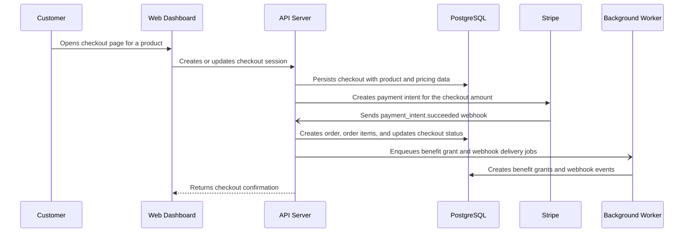

# Checkout Purchase Flow

```mermaid
sequenceDiagram
    participant customer as Customer
    participant web-dashboard as Web Dashboard
    participant api-server as API Server
    participant postgresql as PostgreSQL
    participant stripe as Stripe
    participant background-worker as Background Worker

    customer ->> web-dashboard: Opens checkout page for a product
    web-dashboard ->> api-server: Creates or updates checkout session
    api-server ->> postgresql: Persists checkout with product and pricing data
    api-server ->> stripe: Creates payment intent for the checkout amount
    stripe -) api-server: Sends payment_intent.succeeded webhook
    api-server ->> postgresql: Creates order, order items, and updates checkout status
    api-server -) background-worker: Enqueues benefit grant and webhook delivery jobs
    background-worker ->> postgresql: Creates benefit grants and webhook events
    api-server -->> web-dashboard: Returns checkout confirmation
```

**Source:** `.archeia/codebase/architecture/dataflow.json`
**Generated:** 2026-04-09
