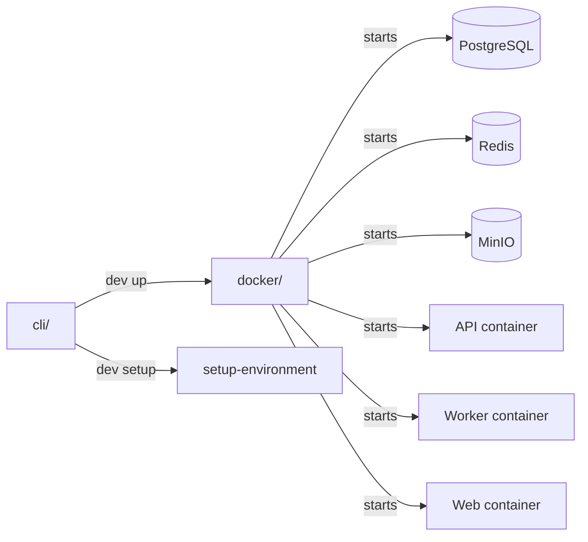

# dev

Development tooling for the Polar monorepo. Contains the `dev` CLI for one-command environment setup, Docker Compose configuration for local infrastructure, and environment bootstrap scripts.

## Structure

## Key Concepts

- **dev CLI** -- `cli/install` adds a `dev` shell alias. `dev up` orchestrates the full environment: Docker services, dependency installation, database migrations, and seed data.
- **Docker Compose** -- `docker/docker-compose.dev.yml` defines all services for local development with hot-reloading and volume mounts for source code.
- **Environment bootstrap** -- `setup-environment` script generates `server/.env` and `clients/apps/web/.env.local` with required variables. Supports `--setup-github-app` for OAuth configuration.

## Usage

First-time setup: `./dev/cli/install && dev up`. See `cli/README.md` for all available commands.

## Learnings

_No learnings recorded yet._
