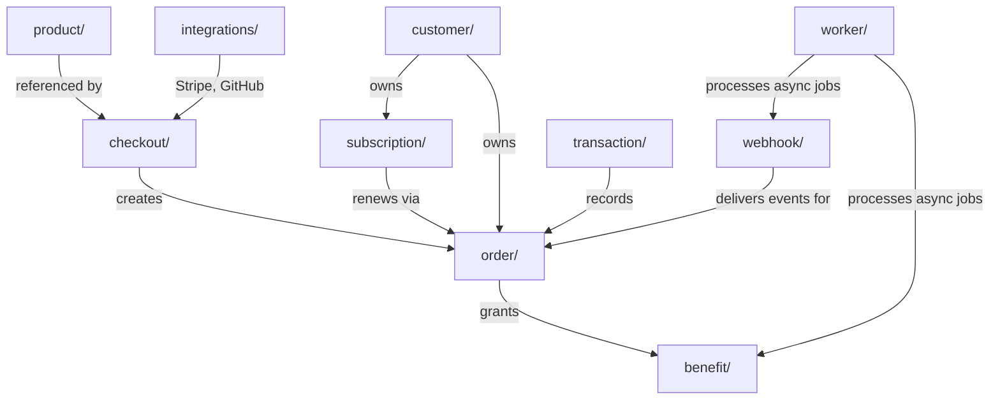

# polar

Core application package containing all domain modules for the Polar payment platform. Each subdirectory is a self-contained domain module (checkout, order, subscription, benefit, etc.) following a consistent internal structure.

## Structure

## Key Concepts

- **Domain modules** -- `checkout/`, `order/`, `subscription/`, `product/`, `customer/`, `benefit/`, `transaction/`, `discount/`, `meter/`, `webhook/`, `oauth2/`, `integrations/` each contain endpoints, service, repository, schemas, tasks, and auth files.
- **Centralized models** -- All SQLAlchemy ORM models live in `models/`, not inside domain modules. This is the one exception to the modular structure.
- **kit/ shared library** -- Database helpers, JWT handling, CORS config, pagination, custom SQLAlchemy types, and other cross-cutting utilities.
- **Benefit strategies** -- `benefit/strategies/` contains per-type implementations: license keys, file downloads, GitHub repository access, Discord access, meter credits, custom benefits.
- **Integration adapters** -- `integrations/` wraps external services: Stripe, GitHub, Discord, Apple, Google, AWS, Loops, Plain, Tinybird.

## Usage

Modules are imported across the codebase via `from polar.{module} import ...`. The API router in `api.py` aggregates all module endpoint routers. Background tasks reference services across modules.

## Learnings

_No learnings recorded yet._
