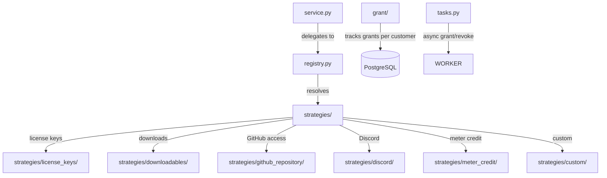

# benefit

Digital benefit management for Polar products. Handles granting and revoking entitlements that customers receive when purchasing products: license keys, file downloads, GitHub repository access, Discord server access, meter credits, and custom benefits.

## Structure

## Key Concepts

- **Strategy pattern** -- `registry.py` maps `BenefitType` enum values to strategy implementations in `strategies/`. Each strategy handles granting, revoking, and validating a specific benefit type.
- **Benefit grants** -- `grant/` tracks which customers have been granted which benefits. Grants are created asynchronously after order completion.
- **Benefit types** -- license_keys, downloadables, github_repository, discord, meter_credit, feature_flag, custom.
- **Product-benefit binding** -- Products are linked to benefits via `ProductBenefit` join model. A product can grant multiple benefits.

## Usage

Called by `order/` after checkout completion to grant benefits. The `webhook/` module delivers benefit-related events to merchants. The customer portal (`customer_portal/`) displays active benefit grants.

## Learnings

_No learnings recorded yet._
