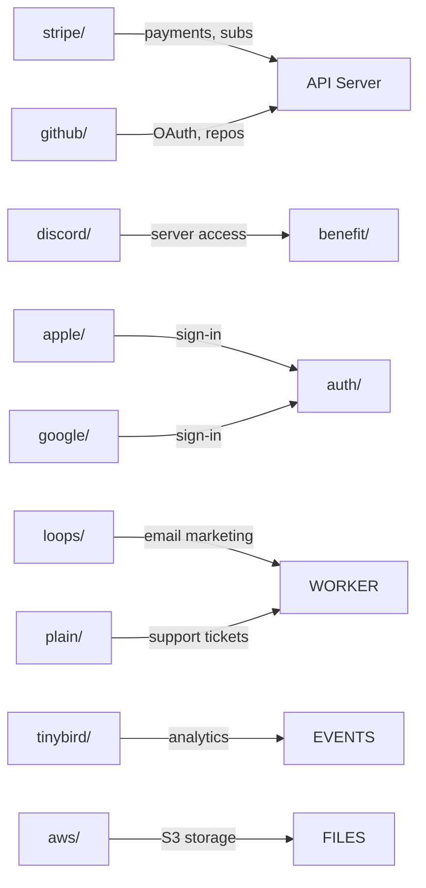

# integrations

Third-party service adapters connecting Polar to external platforms. Each subdirectory wraps an external API with Polar-specific logic for authentication, data synchronization, and event handling.

## Structure

## Key Concepts

- **Stripe** -- Payment processing, subscription management, Connect payouts, webhook handling. Central to all financial operations.
- **GitHub** -- OAuth authentication, repository benefit grants (adding collaborators), GitHub App webhooks.
- **Discord** -- Server role grants as a product benefit via Discord bot integration.
- **Tinybird** -- Real-time analytics and event ingestion for usage-based billing meters.
- **Loops, Plain** -- Email marketing automation and customer support integrations.

## Usage

Integration modules are consumed by domain modules (`checkout/`, `benefit/`, `auth/`, `payout/`) and by background workers for webhook processing and async operations.

## Learnings

_No learnings recorded yet._
