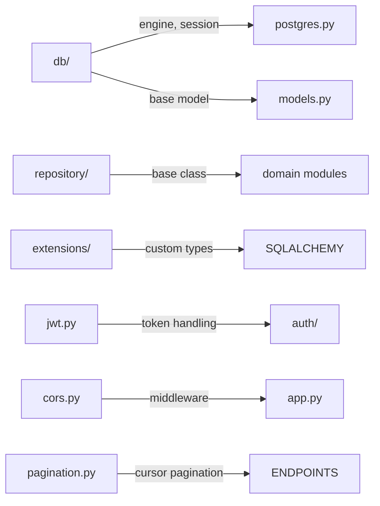

# kit

Shared utility library providing cross-cutting infrastructure used by all domain modules. Contains database helpers, authentication utilities, pagination, custom SQLAlchemy types, and other foundational code.

## Structure

## Key Concepts

- **db/ subpackage** -- Async engine creation (`create_async_engine`), session maker, `RecordModel` base class, and PostgreSQL-specific helpers.
- **repository/ base** -- `RepositoryBase` class that domain repositories inherit from. Provides CRUD operations, sorting, pagination.
- **extensions/** -- Custom SQLAlchemy column types (e.g., `StringEnum`), JSONB helpers.
- **Pagination** -- Cursor-based pagination via `PaginationParams` used across all list endpoints.
- **JWT/JWK** -- JWT token creation and validation, JWKS key management for OAuth2.

## Usage

Imported throughout `server/polar/` via `from polar.kit.db.postgres import ...`, `from polar.kit.pagination import ...`, etc.

## Learnings

_No learnings recorded yet._
