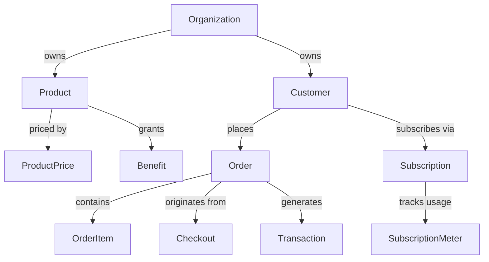

# models

Centralized SQLAlchemy ORM models for all Polar domain entities. This directory is the single source of truth for database schema — models are not split across domain modules.

## Structure

## Key Concepts

- **RecordModel base** -- All models inherit from `polar.kit.db.models.RecordModel` which provides `id` (UUID), `created_at`, `modified_at`, and soft-delete support.
- **StrEnum for states** -- Lifecycle states (checkout status, subscription status, order billing reason) use Python `StrEnum` mapped via `StringEnum` SQLAlchemy type.
- **MetadataMixin** -- Models supporting user-defined metadata use `MetadataMixin` for a JSONB `metadata` column.
- **CustomFieldDataMixin** -- Orders and checkouts support merchant-defined custom fields via this mixin.
- **80+ model files** -- Major entities: `product.py`, `order.py`, `customer.py`, `subscription.py`, `checkout.py`, `organization.py`, `benefit.py`, `transaction.py`, `user.py`, `webhook_endpoint.py`.

## Usage

Imported as `from polar.models import Product, Order, Customer, ...` throughout all domain modules. The models package `__init__.py` re-exports all model classes.

## Learnings

_No learnings recorded yet._
