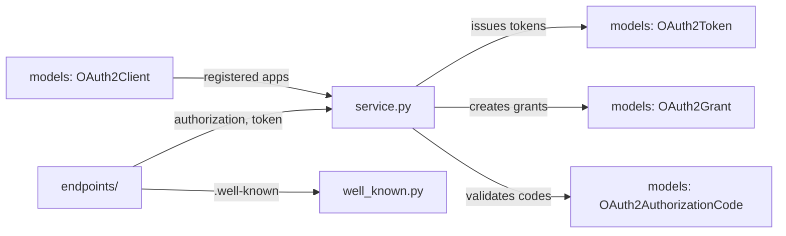

# oauth2

OAuth2 authorization server implementation for Polar. Handles client registration, authorization code flow, token issuance, and grant management. Built on Authlib.

## Structure

## Key Concepts

- **Authorization code flow** -- Standard OAuth2 authorization code grant with PKCE support.
- **Client management** -- OAuth2 clients are registered per organization for third-party integrations.
- **Scopes** -- Fine-grained permission scopes control API access (e.g., `products:read`, `orders:write`).
- **Well-known endpoints** -- `endpoints/well_known.py` serves `.well-known/openid-configuration` and JWKS.

## Usage

The auth middleware (`polar/auth/`) validates OAuth2 bearer tokens on incoming API requests. Third-party developers register OAuth2 clients through the dashboard to access the Polar API on behalf of merchants.

## Learnings

_No learnings recorded yet._
