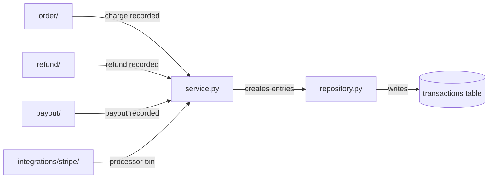

# transaction

Financial ledger for tracking all money movement through Polar. Records charges, refunds, fees, payouts, and balance adjustments as immutable transaction entries.

## Structure

## Key Concepts

- **Immutable ledger** -- Transactions are append-only records of financial events. Each has a type (payment, refund, payout, fee, balance), amount, and currency.
- **Processor transactions** -- `processor_transaction/` tracks raw Stripe transaction data alongside Polar's ledger entries.
- **Organization balance** -- Transaction sums determine organization available balance for payouts.

## Usage

Created by `order/`, `refund/`, `payout/`, and integration modules after financial events. Queried by dashboard analytics and payout calculation logic.

## Learnings

_No learnings recorded yet._
