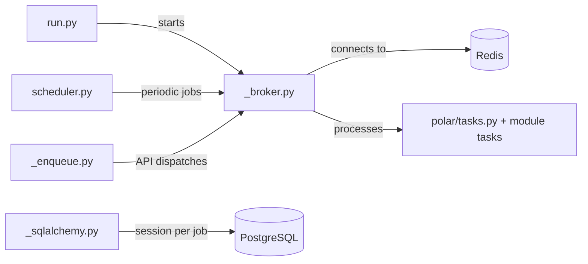

# worker

Dramatiq background worker configuration for processing asynchronous jobs. Handles webhook delivery, benefit grants, payment processing callbacks, email sending, and scheduled tasks.

## Structure

## Key Concepts

- **Dramatiq broker** -- Redis-backed message broker configured in `_broker.py`. Workers consume jobs from named queues defined in `_queues.py`.
- **Enqueue pattern** -- `_enqueue.py` provides the `enqueue_job` function used by API services to dispatch async work. Jobs are flushed via `FlushEnqueuedWorkerJobsMiddleware` at request end.
- **Scheduler** -- `scheduler.py` uses APScheduler to run periodic tasks (e.g., subscription renewals, payout processing).
- **Session management** -- `_sqlalchemy.py` provides per-job database sessions that auto-commit on success and rollback on failure.
- **Debounce** -- `_debounce.py` prevents duplicate job execution within a time window using Redis keys.

## Usage

Domain modules define tasks in their `tasks.py` files and enqueue them via `from polar.worker import enqueue_job`. The worker process is started with `uv run task worker`.

## Learnings

_No learnings recorded yet._
