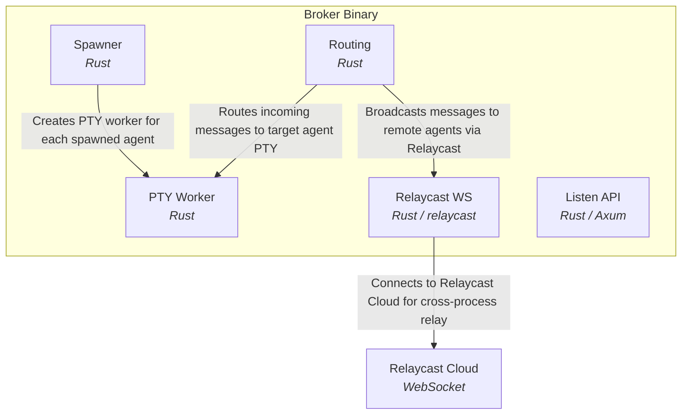

# Components — Broker Binary

```mermaid
flowchart TB
    subgraph boundary [Broker Binary]
        BROKER_SPAWNER[Spawner<br/><i>Rust</i>]
        BROKER_PTY_WORKER[PTY Worker<br/><i>Rust</i>]
        BROKER_ROUTING[Routing<br/><i>Rust</i>]
        BROKER_RELAYCAST_WS[Relaycast WS<br/><i>Rust / relaycast</i>]
        BROKER_LISTEN_API[Listen API<br/><i>Rust / Axum</i>]
    end
    RELAYCAST_CLOUD[Relaycast Cloud<br/><i>WebSocket</i>]

    BROKER_SPAWNER -->|Creates PTY worker for each spawned agent| BROKER_PTY_WORKER
    BROKER_ROUTING -->|Routes incoming messages to target agent PTY| BROKER_PTY_WORKER
    BROKER_ROUTING -->|Broadcasts messages to remote agents via Relaycast| BROKER_RELAYCAST_WS
    BROKER_RELAYCAST_WS -->|Connects to Relaycast Cloud for cross-process relay| RELAYCAST_CLOUD
```

**Source:** `.archeia/codebase/architecture/components.json`
**Generated:** 2026-04-10
