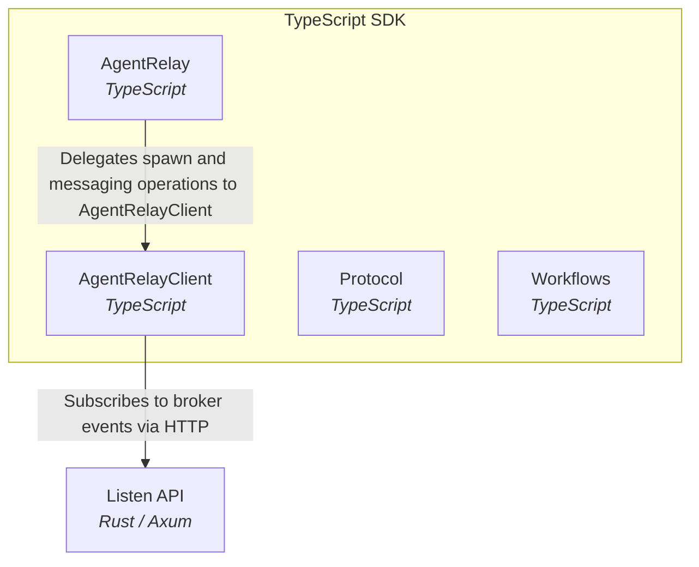

# Components — TypeScript SDK

```mermaid
flowchart TB
    subgraph boundary [TypeScript SDK]
        SDK_CLIENT[AgentRelayClient<br/><i>TypeScript</i>]
        SDK_RELAY[AgentRelay<br/><i>TypeScript</i>]
        SDK_PROTOCOL[Protocol<br/><i>TypeScript</i>]
        SDK_WORKFLOWS[Workflows<br/><i>TypeScript</i>]
    end
    BROKER_LISTEN_API[Listen API<br/><i>Rust / Axum</i>]

    SDK_RELAY -->|Delegates spawn and messaging operations to AgentRelayClient| SDK_CLIENT
    SDK_CLIENT -->|Subscribes to broker events via HTTP| BROKER_LISTEN_API
```

**Source:** `.archeia/codebase/architecture/components.json`
**Generated:** 2026-04-10
