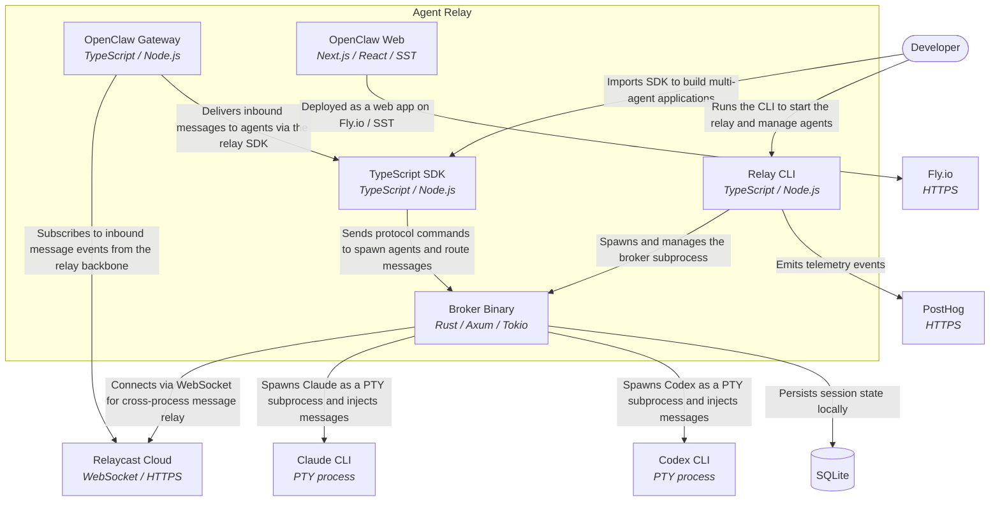

# Container Diagram — Agent Relay

```mermaid
flowchart TB
    DEVELOPER([Developer])
    subgraph boundary [Agent Relay]
        RELAY_CLI[Relay CLI<br/><i>TypeScript / Node.js</i>]
        BROKER_BINARY[Broker Binary<br/><i>Rust / Axum / Tokio</i>]
        SDK[TypeScript SDK<br/><i>TypeScript / Node.js</i>]
        OPENCLAW_GATEWAY[OpenClaw Gateway<br/><i>TypeScript / Node.js</i>]
        OPENCLAW_WEB[OpenClaw Web<br/><i>Next.js / React / SST</i>]
    end
    RELAYCAST_CLOUD[Relaycast Cloud<br/><i>WebSocket / HTTPS</i>]
    CLAUDE_CLI[Claude CLI<br/><i>PTY process</i>]
    CODEX_CLI[Codex CLI<br/><i>PTY process</i>]
    POSTHOG[PostHog<br/><i>HTTPS</i>]
    SQLITE[(SQLite)]
    FLY_IO[Fly.io<br/><i>HTTPS</i>]

    DEVELOPER -->|Imports SDK to build multi-agent applications| SDK
    DEVELOPER -->|Runs the CLI to start the relay and manage agents| RELAY_CLI
    RELAY_CLI -->|Spawns and manages the broker subprocess| BROKER_BINARY
    SDK -->|Sends protocol commands to spawn agents and route messages| BROKER_BINARY
    BROKER_BINARY -->|Connects via WebSocket for cross-process message relay| RELAYCAST_CLOUD
    BROKER_BINARY -->|Spawns Claude as a PTY subprocess and injects messages| CLAUDE_CLI
    BROKER_BINARY -->|Spawns Codex as a PTY subprocess and injects messages| CODEX_CLI
    BROKER_BINARY -->|Persists session state locally| SQLITE
    OPENCLAW_GATEWAY -->|Subscribes to inbound message events from the relay backbone| RELAYCAST_CLOUD
    OPENCLAW_GATEWAY -->|Delivers inbound messages to agents via the relay SDK| SDK
    RELAY_CLI -->|Emits telemetry events| POSTHOG
    OPENCLAW_WEB -->|Deployed as a web app on Fly.io / SST| FLY_IO
```

**Source:** `.archeia/codebase/architecture/containers.json`
**Generated:** 2026-04-10
