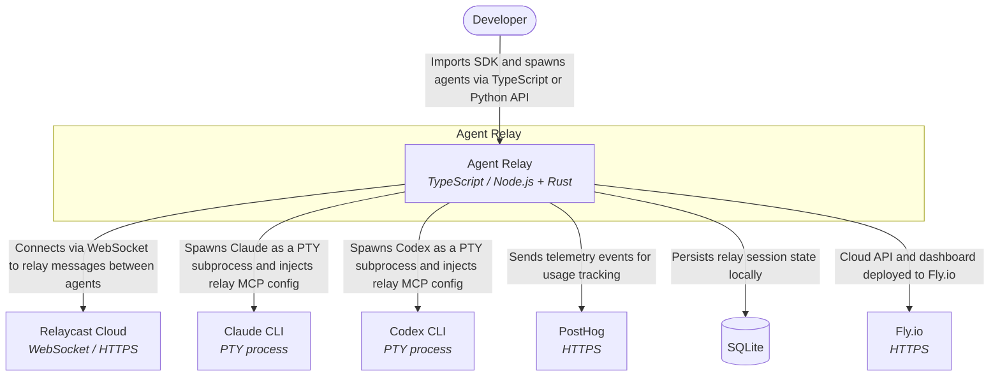

# System Context — Agent Relay

```mermaid
flowchart TB
    DEVELOPER([Developer])
    subgraph boundary [Agent Relay]
        AGENT_RELAY[Agent Relay<br/><i>TypeScript / Node.js + Rust</i>]
    end
    RELAYCAST_CLOUD[Relaycast Cloud<br/><i>WebSocket / HTTPS</i>]
    CLAUDE_CLI[Claude CLI<br/><i>PTY process</i>]
    CODEX_CLI[Codex CLI<br/><i>PTY process</i>]
    POSTHOG[PostHog<br/><i>HTTPS</i>]
    SQLITE[(SQLite)]
    FLY_IO[Fly.io<br/><i>HTTPS</i>]

    DEVELOPER -->|Imports SDK and spawns agents via TypeScript or Python API| AGENT_RELAY
    AGENT_RELAY -->|Connects via WebSocket to relay messages between agents| RELAYCAST_CLOUD
    AGENT_RELAY -->|Spawns Claude as a PTY subprocess and injects relay MCP config| CLAUDE_CLI
    AGENT_RELAY -->|Spawns Codex as a PTY subprocess and injects relay MCP config| CODEX_CLI
    AGENT_RELAY -->|Sends telemetry events for usage tracking| POSTHOG
    AGENT_RELAY -->|Persists relay session state locally| SQLITE
    AGENT_RELAY -->|Cloud API and dashboard deployed to Fly.io| FLY_IO
```

**Source:** `.archeia/codebase/architecture/system.json`
**Generated:** 2026-04-10
