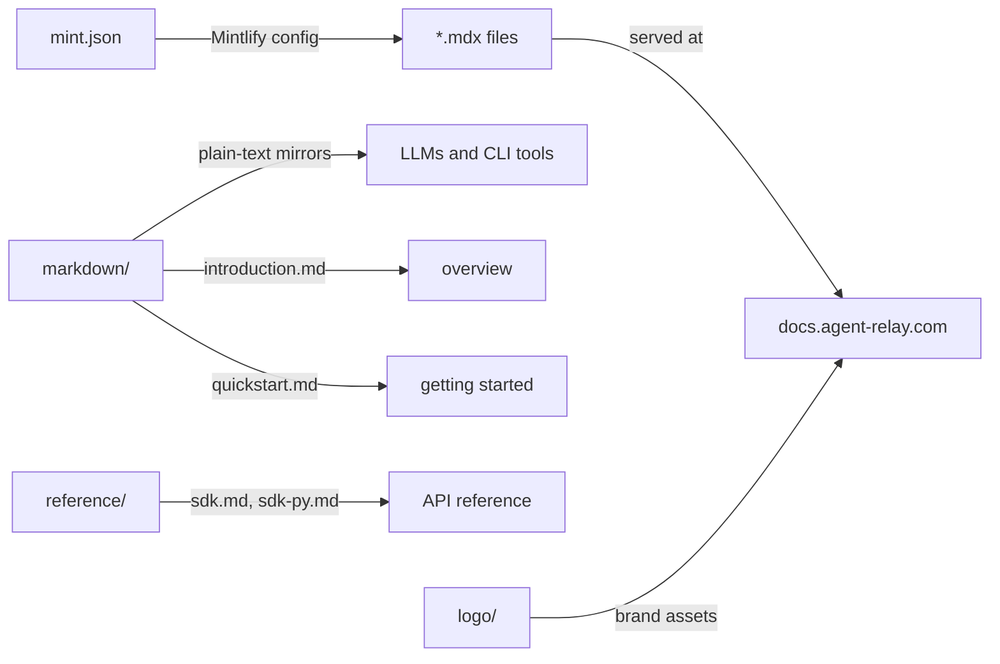

# docs

Documentation for Agent Relay — split between Mintlify MDX source (for the hosted docs site) and plain Markdown mirrors (for LLMs, CLI tools, and programmatic access).

## Structure



## Key Concepts

- **Two doc formats** — MDX files (`.mdx`) at the root are Mintlify source for the rendered docs site. `markdown/` contains plain `.md` mirrors of the same content, designed for LLMs and terminal access.
- **Mintlify setup** — `mint.json` configures navigation, branding, and analytics. Run locally with `npm run docs` (from repo root, runs `npx mintlify dev` in `docs/`).
- **Machine-readable docs** — `docs/markdown/` is the canonical plain-text source for the public API; linked from the README and designed to be fetched via `curl`.
- **Reference files** — `docs/reference/` contains `sdk.md` and `sdk-py.md` — the TypeScript and Python SDK API references.

## Usage

`docs/markdown/` is referenced from `README.md` and the Mintlify site. No other packages import from `docs/`.

Run the Mintlify dev server:
```bash
npm run docs   # from repo root
```

**Evidence:** `docs/markdown/introduction.md`, `README.md`, `package.json` (scripts.docs)

## Learnings

_Seed entry — append learnings from work done here._
