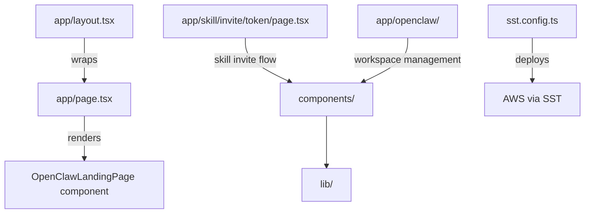

# openclaw-web

Next.js 14 web app for the Agent Relay OpenClaw dashboard. Serves the landing page, setup flow, and skill invite pages for connecting OpenClaw workspaces to Agent Relay. Deployed via SST to AWS.

## Structure



## Key Concepts

- **OpenClaw landing** — `app/page.tsx` renders `OpenClawLandingPage` with setup instructions, messaging features, and observer mode docs targeted at teams adopting Agent Relay for OpenClaw.
- **Skill invite flow** — `app/skill/invite/[token]/` handles token-based workspace invitation for connecting new OpenClaw instances to an Agent Relay workspace.
- **SST deployment** — `sst.config.ts` configures AWS deployment via the SST framework. The dev command is `npm run dev:web` from the repo root (runs `sst dev`).
- **Separate from root npm package** — this app is a workspace member (`openclaw-web` in `package.json` workspaces) but is NOT bundled into the published npm package.

## Usage

Used by teams setting up Agent Relay integration with OpenClaw. Not imported by other packages. The app is deployed to production at `agentrelay.dev/openclaw`.

**Evidence:** `openclaw-web/app/page.tsx`, `openclaw-web/sst.config.ts`, `package.json` (workspaces, scripts.dev:web)

## Local Development

```bash
npm run dev:web   # from repo root — runs sst dev in openclaw-web/
```

**Evidence:** `package.json` (scripts.dev:web)

## Learnings

_Seed entry — append learnings from work done here._
