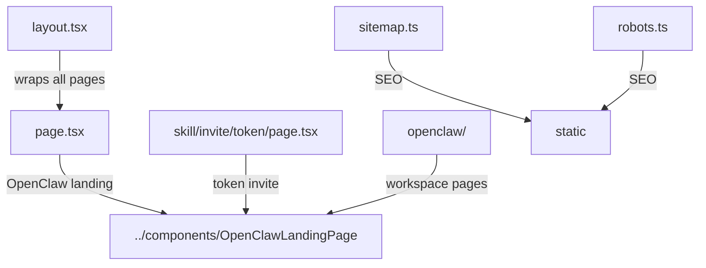

# openclaw-web/app

Next.js App Router pages for the OpenClaw web dashboard. Contains the landing page, workspace management, and skill invite flow.

## Structure

## Key Concepts

- **App Router** — uses Next.js 14 App Router conventions (`layout.tsx`, `page.tsx`, dynamic routes like `skill/invite/[token]/`).
- **`globals.css`** — global CSS included via `layout.tsx`; shared across all routes.
- **Metadata** — each `page.tsx` exports a `metadata` object with OpenGraph and Twitter card fields for SEO.
- **Skill invite** — `skill/invite/[token]/page.tsx` processes workspace invite tokens for connecting OpenClaw to Agent Relay.

## Usage

Not imported by other packages. Consumed via Next.js routing at `agentrelay.dev/` (root) and `agentrelay.dev/openclaw`.

**Evidence:** `openclaw-web/app/page.tsx`, `openclaw-web/app/layout.tsx`

## Learnings

_Seed entry — append learnings from work done here._
