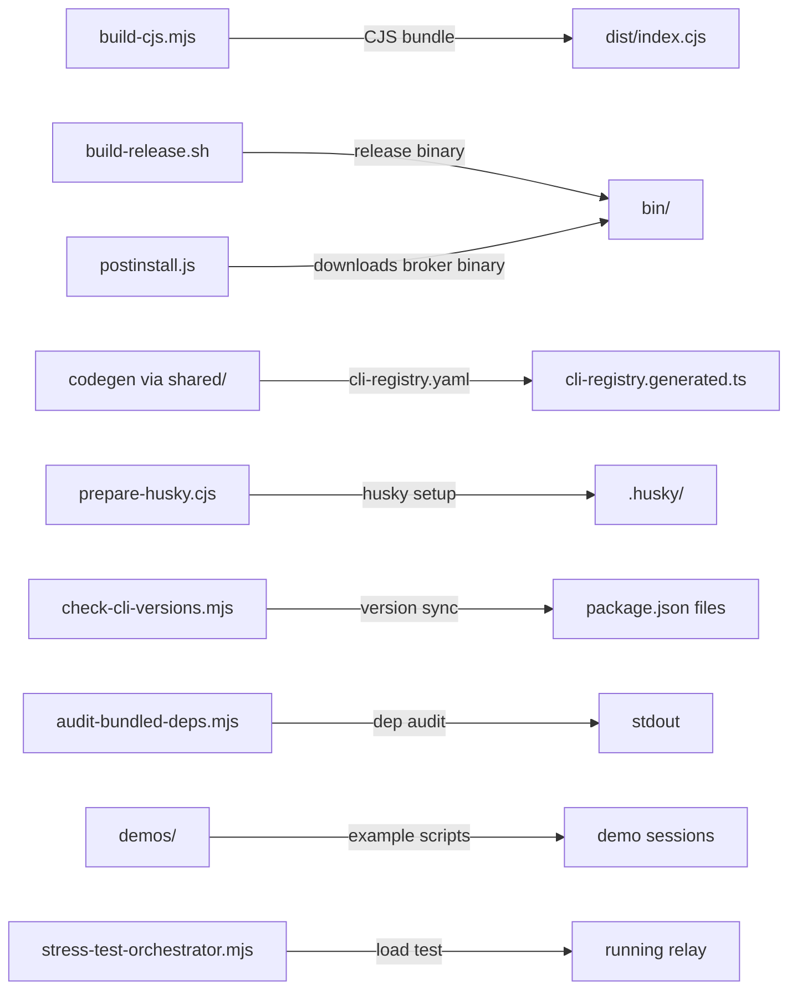

# scripts

Build, codegen, dev utility, and CI support scripts for Agent Relay. Most are invoked via `npm run <script>` from the root; a few are called directly by CI workflows.

## Structure

## Key Concepts

- **`postinstall.js`** — runs after `npm install`; downloads and installs the prebuilt Rust broker binary for the current platform. Key to the install experience.
- **`build-cjs.mjs`** — builds the CommonJS bundle (`dist/index.cjs`) from the ESM output. Run automatically as `postbuild`.
- **`check-cli-versions.mjs`** — checks that CLI version references (in `packages/shared/cli-registry.yaml` and related configs) are synchronized across the monorepo. Run with `--update` flag to auto-fix.
- **`codegen` scripts** — `packages/shared/codegen-ts.mjs` and `codegen-py.mjs` generate type models from `cli-registry.yaml`; triggered by `npm run codegen:models`.
- **`demos/`** — standalone demo scripts for showcasing relay features. Not part of the test suite.
- **`hooks/install.sh`** — installs git hooks via `npm run hooks:install`.

## Usage

Scripts are invoked via `package.json` scripts or CI workflows. Do not call `scripts/postinstall.js` manually — it is wired as a postinstall hook. Codegen scripts should be run via `npm run codegen:models`, not directly.

**Evidence:** `package.json` (scripts: postinstall, build:cjs, check:cli-versions, codegen:models, hooks:install), `scripts/postinstall.js`, `scripts/build-cjs.mjs`

## Learnings

_Seed entry — append learnings from work done here._
