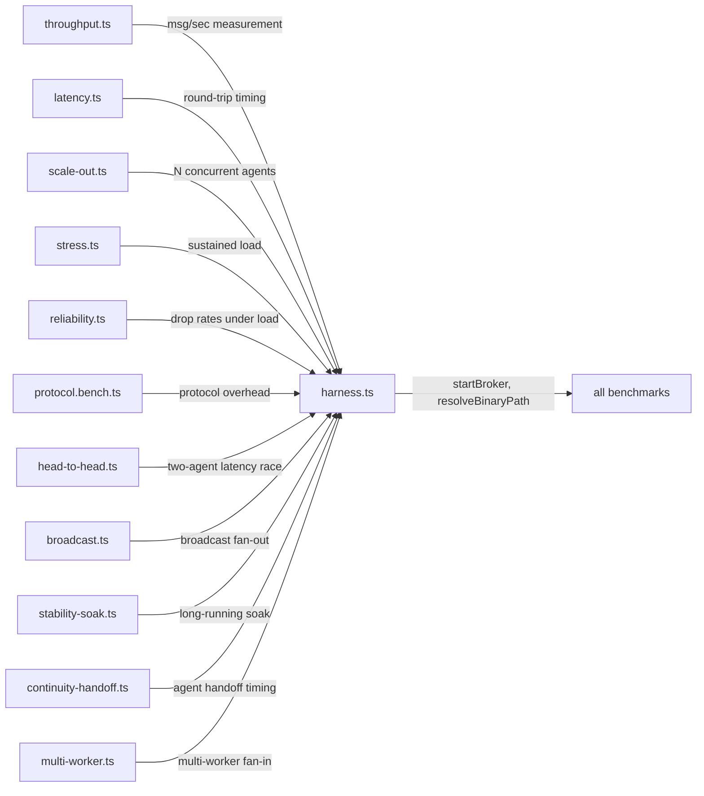

# tests/benchmarks

Performance benchmark suite for the Agent Relay broker. Each file measures a specific performance dimension — throughput, latency, scale-out, reliability, and protocol overhead. All benchmarks use a shared harness that starts a live broker subprocess.

## Structure



## Key Concepts

- **`harness.ts`** — shared utilities: `startBroker()` spins up an `AgentRelayClient` using the binary at `AGENT_RELAY_BIN` env var or auto-detected from `target/debug/` or `target/release/`; `resolveBinaryPath()` handles platform and build variant selection; `QUICK` flag truncates run duration for CI.
- **Run any benchmark:** `npx tsx tests/benchmarks/<name>.ts [--quick]`
- **`--quick` flag** — reduces iteration counts and durations for CI runs; the `QUICK` constant in `harness.ts` enables this.
- **Not in vitest** — benchmarks are run directly with `tsx`, not via `vitest run`. They require a built broker binary.

## Usage

Benchmarks are standalone scripts, not part of `npm test`. Used for performance regression checks and capacity planning. The `parity/` directory imports from `harness.ts` for broker lifecycle utilities.

```bash
AGENT_RELAY_BIN=./target/release/agent-relay-broker npx tsx tests/benchmarks/throughput.ts
npx tsx tests/benchmarks/latency.ts --quick
```

**Evidence:** `tests/benchmarks/harness.ts`, `tests/parity/orch-to-worker.ts`

## Learnings

_Seed entry — append learnings from work done here._
