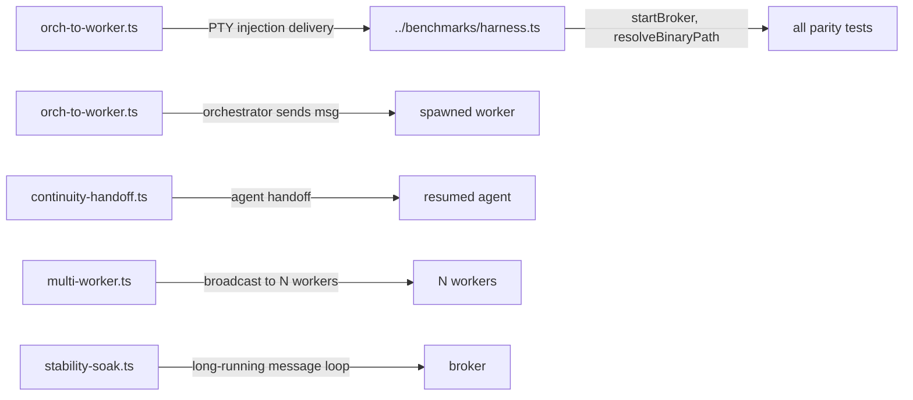

# tests/parity

Parity tests that verify TypeScript SDK behavior matches the integration test suite. Each file is a port of an existing integration test (`tests/integration/`) using the broker-SDK directly, confirming that PTY injection, message routing, and orchestrator-to-worker delivery work correctly end-to-end.

## Structure



## Key Concepts

- **Parity vs integration** — `tests/integration/` tests use the full CLI or Node.js test runner with spawned real agents; parity tests use `AgentRelayClient` directly with `cat` as a stub CLI to verify message delivery without real AI CLIs.
- **Depends on `harness.ts`** — imports `resolveBinaryPath` and `randomName` from `../benchmarks/harness.ts`. The harness handles broker binary location.
- **PTY injection verification** — `orch-to-worker.ts` confirms that orchestrator messages are injected into worker PTY stdin and readable on stdout — the core delivery mechanism of the relay.
- **Run directly with tsx:** `npx tsx tests/parity/<name>.ts`

## Usage

Run when verifying that broker-level changes don't break message delivery semantics. Not in `npm test` (vitest run) — run manually or in CI stress workflows.

```bash
npx tsx tests/parity/orch-to-worker.ts
```

**Evidence:** `tests/parity/orch-to-worker.ts`, `tests/benchmarks/harness.ts`

## Learnings

_Seed entry — append learnings from work done here._
