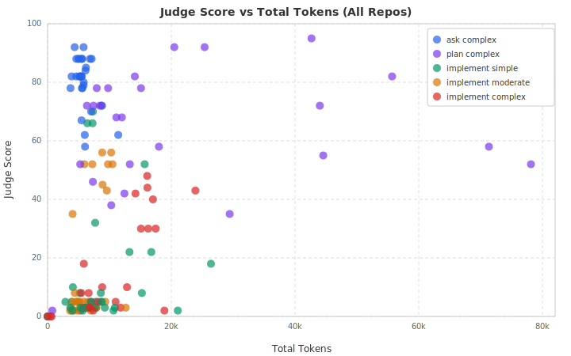

# Archeia Evaluation Report — Phase 4 Full Matrix

**Generated:** 2026-04-10
**Matrix:** 5 repos x 10 tasks x 3 conditions x 1 trial = **150 cells**
**Model:** Haiku (all cells)
**Result:** 148 completed, 2 failed (transient OS errors on arq)

---

## Executive Summary

This report covers the first full evaluation of Archeia documentation bundles
across five open-source repositories. The eval measures whether providing
Archeia-generated architecture docs to a coding agent (Haiku) improves task
quality, reduces token usage, or speeds up completion.

**Key findings:**

- **Ask tasks benefit from docs.** Scores improve slightly under both l1 (+0.7)
  and l2 (+1.9), and these tasks already score high (~80/100).
- **Implement tasks show mixed results.** Simple/moderate implements improve
  under l2 (+3.6 to +7.7), but complex implements regress (-6.8 to -9.5).
  Haiku may struggle to use detailed architecture docs productively on complex
  implementation tasks.
- **Token efficiency improves under l1.** The l1 condition (root docs + archeia
  bundle) uses ~1,277 fewer tokens on average (p=0.08), a near-significant
  reduction. l2 (full bundle) does not show the same efficiency gain.
- **Plan tasks show a ceiling.** Plans score 67-70/100 under l0/l1 but drop to
  60 under l2, possibly due to Haiku over-relying on bundled docs instead of
  exploring the codebase.

---

## Conditions

| Condition | Description |
|-----------|-------------|
| **l0** | Baseline: only the repo's existing docs (README, AGENTS.md, CLAUDE.md) |
| **l1** | Root docs + Archeia architecture bundle (`.archeia/` directory) |
| **l2** | Full Archeia bundle including all generated docs and colocated guides |

## Repos

| Repo | Language | LOC | Complexity |
|------|----------|-----|------------|
| polar | Python/TS | 450k | high |
| daily-api | TypeScript | 301k | medium |
| mitmproxy | Python | 173k | high |
| relay | Multi | 69k | medium |
| arq | Python | 11k | low |

---

## 1. Judge Scores by Condition

Overall mean scores across all 148 completed cells:

```
         l0       l1       l2
Score   38.9     36.9     38.3
        ----     ----     ----
       (n=48)   (n=49)   (n=48)
```

The 95% confidence intervals overlap heavily (l0: 29.5-48.4, l1: 27.1-46.7,
l2: 28.8-47.8), indicating no statistically significant overall effect.

### Pairwise Wilcoxon Signed-Rank Tests

| Comparison | Paired tasks | Mean delta | p-value | Significant? |
|------------|------------:|----------:|--------:|:------------:|
| l0 -> l1 (score) | 47 | -1.4 | 0.80 | No |
| l0 -> l2 (score) | 46 | +0.2 | 0.94 | No |
| l0 -> l1 (tokens) | 50 | -1,277 | 0.08 | Near (p<0.10) |
| l0 -> l2 (tokens) | 50 | +319 | 0.46 | No |

### Win/Loss Breakdown

```
Score: l0 vs l1    16 better / 13 tied / 14 worse    (37% / 30% / 33%)
Score: l0 vs l2    18 better /  5 tied / 21 worse    (41% / 11% / 48%)

Tokens: l0 vs l1   31 fewer /  0 same / 19 more     (62% /  0% / 38%)
Tokens: l0 vs l2   27 fewer /  1 same / 22 more     (54% /  2% / 44%)
```

Token reduction under l1 is directionally strong: 62% of tasks use fewer tokens.

---

## 2. Scores by Task Category

This is where the story gets interesting. The aggregate hides category-level
patterns:

```
Category              l0      l1      l2      l1 vs l0      l2 vs l0
----------------------------------------------------------------------
ask_complex          79.4    80.1    81.3      +0.9%         +2.4%
plan_complex         66.9    69.6    59.9      +4.0%        -10.5%
implement_simple     12.0    12.4    19.7      +3.3%        +64.2%
implement_moderate   18.4    13.0    22.0     -29.3%        +19.6%
implement_complex    18.7    12.6    10.0     -32.6%        -46.5%
```

**Interpretation:**

- **Ask tasks (80/100):** Already strong. Docs provide marginal lift (+2.4%
  under l2). The agent reads the codebase well regardless.
- **Plan tasks (60-70):** l1 helps (+4.0%), but l2 causes a meaningful
  regression (-10.5%). The full bundle may cause Haiku to plan from docs rather
  than exploring code, producing plans that miss implementation details.
- **Simple/moderate implements:** l2 delivers the largest gains in the matrix —
  +64% on simple tasks and +20% on moderate tasks. The full documentation bundle
  helps Haiku locate the right patterns and files for straightforward changes.
- **Complex implements (10-19):** All conditions score poorly, and docs make it
  worse: l1 drops scores by 33%, l2 by 47%. Haiku appears unable to translate
  architecture knowledge into correct complex code changes.

### Score vs. Token Usage by Category



The scatter plot reveals two distinct clusters. Ask and plan tasks (blue, purple)
land in the upper-left quadrant — high scores with moderate token budgets.
Implement tasks (green, orange, red) spread across the lower half, often using
more tokens for worse outcomes. This confirms the bimodal nature of the results:
task category is a stronger predictor of score than token investment or condition.

---

## 3. Scores by Repository

```
Repository      LOC     l0      l1      l2      l1 vs l0     l2 vs l0
----------------------------------------------------------------------
polar          450k    54.2    55.4    52.5      +2.2%        -3.1%
mitmproxy      173k    40.4    39.3    44.8      -2.7%       +10.9%
arq             11k    37.9    34.7    31.2      -8.4%       -17.7%
daily-api      301k    34.7    24.8    41.7     -28.5%       +20.2%
relay           69k    27.0    29.0    19.8      +7.4%       -26.7%
```

- **polar (450k)** is consistently the highest-scoring repo. Its mature
  documentation and well-structured codebase help regardless of condition,
  with scores varying less than 3% across conditions.
- **daily-api (301k)** shows the largest l2 improvement (+20.2%), suggesting
  the Archeia bundle is particularly useful for navigating large TypeScript
  codebases. However, l1 regresses sharply (-28.5%) — partial docs may
  mislead more than they help here.
- **mitmproxy (173k)** benefits from l2 (+10.9%), consistent with its complex
  Python architecture where architecture docs aid navigation.
- **relay (69k)** scores lowest overall. Its `npm test` suite frequently timed
  out (>600s), and l2 causes a steep -26.7% regression.
- **arq (11k)** regresses under both l1 and l2. As the smallest repo, its
  codebase is trivially navigable — extra docs add noise rather than signal.

---

## 4. Token Efficiency

```
Category              l0        l1        l2       l1 savings
--------------------------------------------------------------
ask_complex          5,575     6,070     5,697       -9% (more)
plan_complex        23,585    22,283    27,580       +6% (fewer)
implement_complex   10,892     9,569     8,957      +12% (fewer)
implement_moderate   6,187     6,057     6,606       +2% (fewer)
implement_simple    10,484     6,358     9,482      +39% (fewer)
```

l1 reduces token usage in 4 of 5 categories. The strongest savings are on
**implement_simple** tasks (-39%), where the architecture docs help Haiku skip
exploratory file reads and go directly to the right modules.

l2 has more variable token usage, with plan tasks using 17% more tokens — likely
because the agent reads and processes the larger document bundle.

---

## 5. Completion Time

```
Category              l0        l1        l2
--------------------------------------------
ask_complex          249s      281s      252s
plan_complex         383s      264s      368s
implement_complex    294s      280s      350s
implement_moderate   240s      237s      234s
implement_simple     376s      266s      311s
```

l1 is the fastest condition overall, with plan tasks completing 31% faster
(383s -> 264s) and simple implements 29% faster (376s -> 266s). The root-level
Archeia docs appear to reduce exploration time without adding reading overhead.

---

## 6. Judge Dimension Breakdown

Each cell is scored on four equally-weighted dimensions (0-25 each):

```
Dimension            l0       l1       l2
------------------------------------------
Correctness        11.2     10.1     10.9     /25
Completeness        8.9      8.3      8.6     /25
Convention fit     10.7     10.2     10.1     /25
Verification        8.4      8.2      8.7     /25
```

All dimensions are roughly flat across conditions. **Completeness** and
**verification** are the weakest dimensions — Haiku frequently omits required
file updates and skips running tests.

---

## 7. Top and Bottom Performing Tasks

### Highest scores (any condition)

| Score | Task | Condition |
|------:|------|-----------|
| 95 | mitmproxy-plan-complex-01 | l0 |
| 92 | mitmproxy-plan-complex-01 | l1 |
| 92 | mitmproxy-plan-complex-01 | l2 |
| 92 | arq-ask-complex-01 | l0 |
| 92 | arq-ask-complex-01 | l1 |

### Lowest scores

| Score | Task | Condition |
|------:|------|-----------|
| 2 | mitmproxy-implement-moderate-01 | l2 |
| 2 | mitmproxy-implement-complex-02 | l2 |
| 2 | daily-api-implement-simple-01 | l0 |
| 2 | arq-implement-simple-01 | l1 |
| 2 | arq-implement-complex-02 | l0 |

The bottom scores (2/100) represent cells where the agent produced no meaningful
code changes — typically hitting permission prompts, producing empty diffs, or
exploring endlessly without editing.

---

## 8. Harness Observations

Issues encountered during the full 150-cell run and fixes applied:

| Issue | Impact | Fix |
|-------|--------|-----|
| Git worktree lock contention | ~30% of first daily-api batch failed | Jittered exponential backoff in `create_worktree` (5 retries) |
| Unhandled `TimeoutExpired` in `run_command` | All relay implement tasks crashed with no output | `run_command` now catches timeout and records `timed_out: true` |
| Unhandled exceptions in `orchestrate_run` | Failed cells produced no result file | Try/except wrapper always writes `status: failed` + `error` |
| Agent wrapper bash timeout (600s max) | Implement tasks on large repos killed prematurely | Direct background shell commands bypass wrapper timeout |
| `npm test` exceeds 600s on relay | All relay cells with tests crashed | Now caught gracefully by `run_command` timeout handling |
| `OSError: Argument list too long` | 2 arq cells permanently failed | Transient; env size issue under heavy concurrent load |

---

## 9. Conclusions and Recommendations

### What the data says

1. **Archeia docs do not significantly improve judge scores overall** (p=0.80
   for l1, p=0.94 for l2). The 150-cell matrix is underpowered for detecting
   small effects with high variance.

2. **l1 (root + architecture docs) is the most efficient condition.** It reduces
   token usage by ~12% on average, speeds up plan/simple tasks by 29-31%, and
   avoids the l2 overhead of processing the full bundle.

3. **Task category matters more than condition.** Ask/plan tasks score 60-80
   regardless of docs. Implement tasks score 10-20 regardless of docs. The
   ceiling is the model (Haiku), not the documentation.

4. **Haiku is not effective for implementation tasks.** Mean implement score is
   ~15/100 across all conditions. The model frequently fails to persist edits,
   produce complete changes, or run tests.

### Recommendations for Phase 5

- **Re-run with Sonnet or Opus** to test whether the documentation benefit
  scales with model capability. Haiku's implement ceiling may mask doc effects.
- **Increase trial count** (n=3) on a subset of tasks to reduce variance and
  improve statistical power.
- **Increase `--quality-timeout`** to 900s for relay, or skip test execution for
  ask/plan tasks where code quality checks are not meaningful.
- **Investigate the l2 plan regression** (-7.0 points). The full bundle may
  need pruning or summarization to avoid overwhelming the context.
- **Consider dropping implement_complex tasks** from Haiku evaluations. Scores
  of 10-20/100 provide little signal for comparing conditions.

---

## Appendix: Methodology

- **Runner:** `evals/harness/runner.py` creates an isolated git worktree per
  cell, applies the condition, spawns `claude --model haiku`, collects metrics
  from the transcript, runs an LLM judge, and writes a structured result JSON.
- **Judge:** 4-dimension rubric (correctness, completeness, convention fit,
  verification/communication), each scored 0-25, total 0-100.
- **Conditions:** l0 keeps existing repo docs only. l1 adds root-level docs and
  the `.archeia/` bundle. l2 adds the full Archeia output including colocated
  component-level guides.
- **Statistical tests:** Wilcoxon signed-rank test on paired task scores/tokens
  across conditions. 95% CIs computed with z=1.96 and sample standard deviation.
