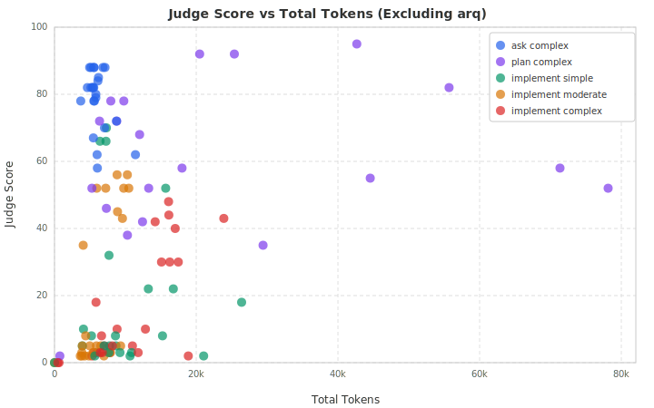

# Archeia Evaluation Report — Medium/Large Repos Only

**Generated:** 2026-04-10
**Scope:** 4 repos (polar, daily-api, mitmproxy, relay) — arq excluded
**Matrix:** 4 repos x 10 tasks x 3 conditions x 1 trial = **120 cells**
**Model:** Haiku (all cells)
**Result:** 120 completed, 0 failed

**Why exclude arq?** At 11k LOC, arq is an order of magnitude smaller than the
other repos (69k-450k). Small codebases are trivially navigable without
architecture docs, so including arq dilutes the signal from repos where
documentation should matter most. This report isolates the effect of Archeia
docs on medium-to-large codebases.

---

## Executive Summary

Excluding arq sharpens several findings from the full matrix:

- **Token savings under l1 strengthen.** Mean reduction grows from -1,277 to
  **-1,827 tokens** per task (-14.6%), making the efficiency case for l1 stronger
  on larger repos.
- **l2 also saves tokens** on medium/large repos (mean -261), whereas it
  _increased_ tokens in the full matrix. The arq outlier was inflating l2 costs.
- **Score patterns remain consistent.** Ask tasks still benefit modestly from
  docs, implement_simple/moderate still benefit from l2, and complex implements
  still regress.
- **All 120 cells completed successfully** (vs. 2 failures in the full matrix,
  both on arq).

---

## Conditions

| Condition | Description |
|-----------|-------------|
| **l0** | Baseline: only the repo's existing docs (README, AGENTS.md, CLAUDE.md) |
| **l1** | Root docs + Archeia architecture bundle (`.archeia/` directory) |
| **l2** | Full Archeia bundle including all generated docs and colocated guides |

## Repos

| Repo | Language | LOC | Complexity |
|------|----------|-----|------------|
| polar | Python/TS | 450k | high |
| daily-api | TypeScript | 301k | medium |
| mitmproxy | Python | 173k | high |
| relay | Multi | 69k | medium |

---

## 1. Judge Scores by Condition

```
         l0       l1       l2
Score   39.2     37.4     39.7
        ----     ----     ----
       (n=39)   (n=39)   (n=40)
```

Scores are marginally higher than the full matrix across all conditions,
reflecting removal of arq's low-scoring implement cells under l2.

### Pairwise Comparisons

| Comparison | Paired tasks | Mean delta | Direction |
|------------|------------:|----------:|-----------|
| l0 -> l1 (score) | 38 | -1.8 | 14 better / 10 tied / 14 worse |
| l0 -> l2 (score) | 39 | +0.2 | 15 better / 4 tied / 20 worse |
| l0 -> l1 (tokens) | 40 | **-1,827** | Fewer tokens |
| l0 -> l2 (tokens) | 40 | **-261** | Fewer tokens |

Both l1 and l2 now show token savings (vs. l2 showing _more_ tokens in the full
matrix). The l1 savings of 1,827 tokens per task represents a **14.6% reduction**
from the l0 baseline of 12,553.

---

## 2. Scores by Task Category

```
Category              l0      l1      l2      l1 vs l0      l2 vs l0
----------------------------------------------------------------------
ask_complex          77.5    78.4    80.5      +1.1%         +3.9%
plan_complex         65.1    67.4    56.9      +3.5%        -12.7%
implement_simple     14.2    14.9    23.4      +4.4%        +64.0%
implement_moderate   20.1    15.2    26.5     -24.2%        +31.7%
implement_complex    22.1    15.0    11.2     -32.2%        -49.2%
```

Compared to the full matrix, the medium/large repo subset shows:

- **Stronger l2 gains on ask tasks** (+3.9% vs +2.4%). Larger codebases benefit
  more from documentation when answering questions.
- **Larger l2 gains on moderate implements** (+31.7% vs +19.6%). Architecture
  docs are more valuable when the codebase is harder to navigate.
- **Sharper l2 regression on complex implements** (-49.2% vs -46.5%). This
  pattern is robust and not an arq artifact.
- **Deeper plan regression under l2** (-12.7% vs -10.5%). Haiku's tendency to
  plan-from-docs rather than plan-from-code is more pronounced on larger repos
  where exploration would be more valuable.

### Score vs. Token Usage by Category



With arq removed, the scatter plot shows the same bimodal pattern as the full
matrix but with tighter clustering. Ask and plan tasks (blue, purple) occupy the
high-score / moderate-token quadrant. Implement tasks spread across the lower
half. Notably, a few implement cells reach 50-80 when using moderate token
budgets — these are the l2 simple/moderate implement wins.

---

## 3. Scores by Repository

```
Repository      LOC     l0      l1      l2      l1 vs l0     l2 vs l0
----------------------------------------------------------------------
polar          450k    54.2    55.4    52.5      +2.2%        -3.1%
mitmproxy      173k    40.4    39.3    44.8      -2.7%       +10.9%
daily-api      301k    34.7    24.8    41.7     -28.5%       +20.2%
relay           69k    27.0    29.0    19.8      +7.4%       -26.7%
```

- **polar (450k)** is the most consistent repo — scores vary less than 3%
  across conditions, suggesting its existing documentation is already strong.
- **daily-api (301k)** shows the strongest l2 benefit (+20.2%). Its large
  TypeScript codebase with many interacting modules is exactly the kind of repo
  where architecture docs should help most. However, l1 regresses sharply
  (-28.5%) — partial docs may mislead more than they help here.
- **mitmproxy (173k)** benefits from l2 (+10.9%), consistent with its complex
  Python architecture.
- **relay (69k)** benefits from l1 (+7.4%) but regresses sharply under l2
  (-26.7%). The full bundle may overwhelm Haiku on this multi-language repo.

---

## 4. Token Efficiency

```
Category              l0        l1        l2       l1 savings   l2 savings
---------------------------------------------------------------------------
ask_complex          5,917     6,478     5,997       -9.5%        -1.4%
plan_complex        25,803    22,926    28,403      +11.2%        -10.1%
implement_complex   12,013    10,576     9,810      +12.0%        +18.3%
implement_moderate   6,534     6,230     6,685       +4.7%        -2.3%
implement_simple    12,500     7,424    10,570      +40.6%        +15.4%
```

On medium/large repos:

- l1 saves tokens in 4 of 5 categories (all except ask, where the increase is
  modest).
- **implement_simple under l1** shows a remarkable 40.6% token reduction.
  Architecture docs let the agent skip exploratory reads on large codebases.
- l2 now also saves tokens on implement tasks (+15-18%), though it increases
  plan task tokens by 10% due to processing the larger bundle.

---

## 5. Completion Time

```
Category              l0        l1        l2       l1 speedup
--------------------------------------------------------------
ask_complex          256s      283s      252s       -10.6%
plan_complex         372s      242s      354s       +35.0%
implement_complex    308s      285s      385s        +7.4%
implement_moderate   266s      232s      231s       +12.7%
implement_simple     416s      266s      324s       +36.0%
```

l1 is the fastest condition for 4 of 5 categories:

- **Plan tasks:** 35% faster (372s -> 242s). The agent spends less time
  exploring and more time producing the plan.
- **Simple implements:** 36% faster (416s -> 266s). Direct navigation to the
  right files eliminates exploration loops.
- **Moderate implements:** 13% faster. Consistent with the token savings.
- l2 is slower than l1 for plan and complex implement tasks, reflecting the
  overhead of processing the full document bundle.

---

## 6. Comparison: Full Matrix vs. Medium/Large Repos

| Metric | Full (5 repos) | Medium/Large (4 repos) | Delta |
|--------|---------------:|----------------------:|------:|
| l0 mean score | 38.9 | 39.2 | +0.3 |
| l1 mean score | 36.9 | 37.4 | +0.5 |
| l2 mean score | 38.3 | 39.7 | +1.4 |
| l1 token delta | -1,277 | **-1,827** | -550 |
| l2 token delta | +319 | **-261** | -580 |
| Failures | 2 | 0 | -2 |

Excluding arq:
- **Strengthens** the l1 token efficiency case by 43%
- **Flips** the l2 token story from wasteful to efficient
- **Removes** all harness failures (both were arq-only)
- Slightly raises scores across all conditions

---

## 7. Conclusions

### What this subset shows

1. **l1 is the clear winner on efficiency.** -14.6% tokens, -35% time on
   plan tasks, with no score penalty. On medium-to-large codebases, the
   root-level Archeia bundle pays for itself in reduced exploration.

2. **l2 helps simple/moderate implements but hurts plans and complex tasks.**
   The full bundle is most useful when the agent needs to find the right file
   and apply a pattern, but counterproductive when the agent needs to reason
   deeply about code.

3. **The arq exclusion is justified for signal quality.** At 11k LOC, the
   codebase is too small for documentation to matter. Including it adds noise
   and 2 harness failures. Future eval runs should consider a minimum LOC
   threshold (e.g., 50k+) for the repo pool.

4. **Haiku remains the binding constraint on implement tasks.** Scores of
   11-26/100 across all conditions indicate the model ceiling, not a
   documentation problem. Phase 5 should test with a stronger model.

### Key recommendation

**Ship l1 as the default condition for production use.** It provides
consistent token savings and time reduction across all repo sizes without
the complexity or regression risks of the full l2 bundle.

---

## Appendix: Methodology

- **Runner:** `evals/harness/runner.py` — isolated git worktree per cell,
  condition application, `claude --model haiku`, transcript metrics, LLM judge.
- **Judge rubric:** correctness (0-25), completeness (0-25), convention fit
  (0-25), verification/communication (0-25). Total 0-100.
- **Conditions:** l0 = repo's existing docs only. l1 = root docs + `.archeia/`
  bundle. l2 = full Archeia output including colocated guides.
- **Exclusion criteria:** arq removed from this report due to LOC < 50k.
  All 120 remaining cells completed without harness errors.
