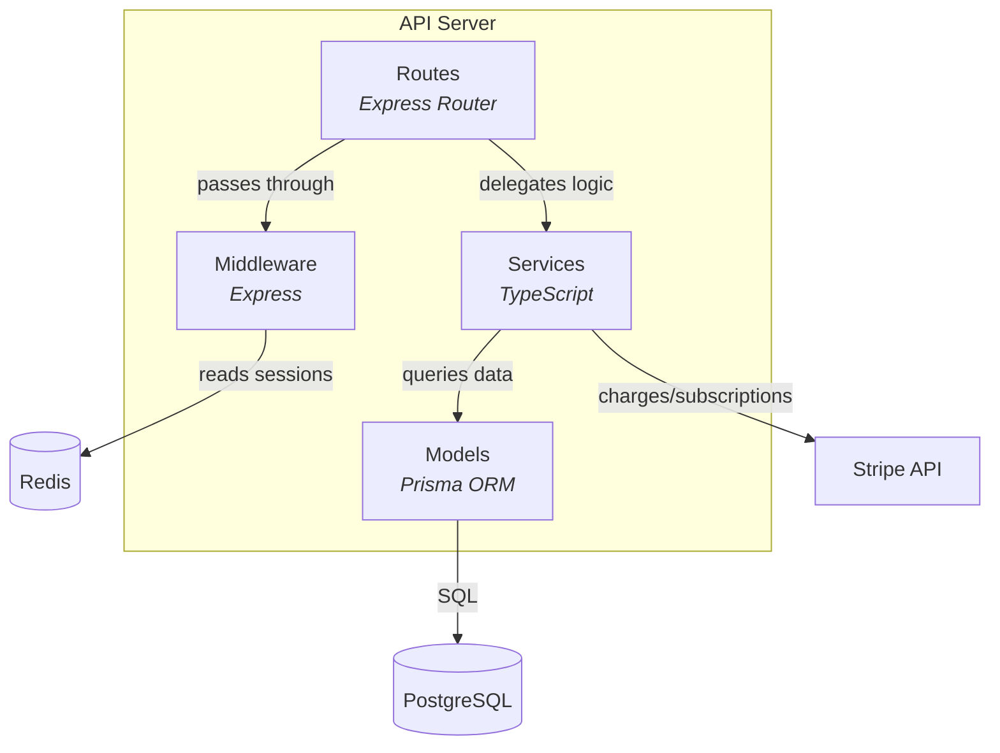

## Purpose

The Component Detail diagram answers: **what are the internal components of a
container and how do they interact?**

This is the C4 Level 3 view — one diagram per container, zooming inside to show
the internal module structure: routes, middleware, services, models. Components
interact with each other and with external systems. This level of detail is only
useful when the project has enough complexity to warrant it (3+ containers with
internal components).

---

## Mapping Rules

1. **Node IDs.** Convert each entity's `id` from kebab-case to
   UPPER_SNAKE_CASE (same convention as context and container diagrams).

2. **Container boundary subgraph.** Use the container's `name` as the
   subgraph label. All of its components go inside:
   ```
   subgraph boundary [API Server]
       API_ROUTES[Routes<br/><i>Express Router</i>]
       API_SERVICES[Services<br/><i>TypeScript</i>]
   end
   ```

3. **Component nodes.** Each entry in the container's `components` array
   becomes a node inside the subgraph with technology annotation:
   ```
   API_ROUTES[Routes<br/><i>Express Router</i>]
   ```

4. **External system nodes.** Only include external systems that appear in
   `relationships` where at least one endpoint is a component of this
   container. Place outside the subgraph. Same shape rules as other flowchart
   diagrams (cylinders for data stores, rectangles for others).

5. **Edge filtering.** Only include relationships where at least one endpoint
   (source or target) is a component of this container. This prevents
   cross-container relationships from cluttering the diagram.

6. **Component limit enforcement.** If a container has more than 12 components,
   include the most interconnected ones (count relationship appearances).
   Log omissions.

---

## Node ID Convention

Same as context and container diagrams: kebab-case to UPPER_SNAKE_CASE.
- `api-routes` → `API_ROUTES`
- `api-middleware` → `API_MIDDLEWARE`
- `worker-jobs` → `WORKER_JOBS`

---

## Shape Convention

| Entity Type | Shape | Example |
|-------------|-------|---------|
| Component (inside boundary) | Rectangle with tech | `API_ROUTES[Routes<br/><i>Express Router</i>]` |
| External system (data store) | Cylinder | `POSTGRESQL[(PostgreSQL)]` |
| External system (other) | Rectangle | `STRIPE_API[Stripe API]` |

Same data store detection as context and container diagrams.

---

## Output Naming

One file per container that has components. Name the file using the container's
`id`:
- `components-api-server.md`
- `components-background-worker.md`
- `components-web-app.md`

The heading uses the container's `name`:
`# Component Detail — API Server`.

---

## Example Transformation

**Input** (`.archeia/codebase/architecture/components.json`, one container):

```json
{
  "containers": [
    {
      "id": "api-server",
      "name": "API Server",
      "components": [
        { "id": "api-routes", "name": "Routes", "technology": "Express Router" },
        { "id": "api-middleware", "name": "Middleware", "technology": "Express" },
        { "id": "api-services", "name": "Services", "technology": "TypeScript" },
        { "id": "api-models", "name": "Models", "technology": "Prisma ORM" }
      ]
    }
  ],
  "external_systems": [
    { "id": "postgresql", "name": "PostgreSQL" },
    { "id": "redis", "name": "Redis" },
    { "id": "stripe-api", "name": "Stripe API" }
  ],
  "relationships": [
    { "source": "api-routes", "target": "api-middleware", "description": "passes through" },
    { "source": "api-routes", "target": "api-services", "description": "delegates logic" },
    { "source": "api-services", "target": "api-models", "description": "queries data" },
    { "source": "api-models", "target": "postgresql", "description": "SQL" },
    { "source": "api-middleware", "target": "redis", "description": "reads sessions" },
    { "source": "api-services", "target": "stripe-api", "description": "charges/subscriptions" }
  ]
}
```

**Output** (`.archeia/codebase/diagrams/components-api-server.md`):

````markdown
# Component Detail — API Server



**Source:** `.archeia/codebase/architecture/components.json` (container: api-server)
**Generated:** 2025-01-15
````

---

## Quality Rubric

- **TRACEABILITY:** Every component node traces to an entry in the container's
  `components` array. Every external system traces to `external_systems`. Every
  edge traces to `relationships`.
- **COMPLETENESS:** All components for this container appear inside the
  boundary (up to the 12-component limit). All external systems referenced by
  this container's component relationships appear.
- **LABELING:** Every edge has a label from the `description` field. Component
  nodes include technology annotations in italics.
- **LIMITS:** Component count per container does not exceed 12. Only
  relationships involving this container's components are shown.

---

## Anti-Patterns

- **Including external systems not referenced by this container.** If
  `stripe-api` only appears in relationships with `api-services`, it should
  only appear in the API Server component diagram — not in the Background
  Worker diagram.
- **Showing cross-container relationships.** A component diagram shows one
  container's internals. Relationships between containers belong in the
  container diagram.
- **Exceeding 12 components per container.** Trim to the most interconnected
  and log omissions.
- **Generating component diagrams for simple projects.** If fewer than 3
  containers have components, skip component diagrams entirely — the container
  diagram provides sufficient detail.
