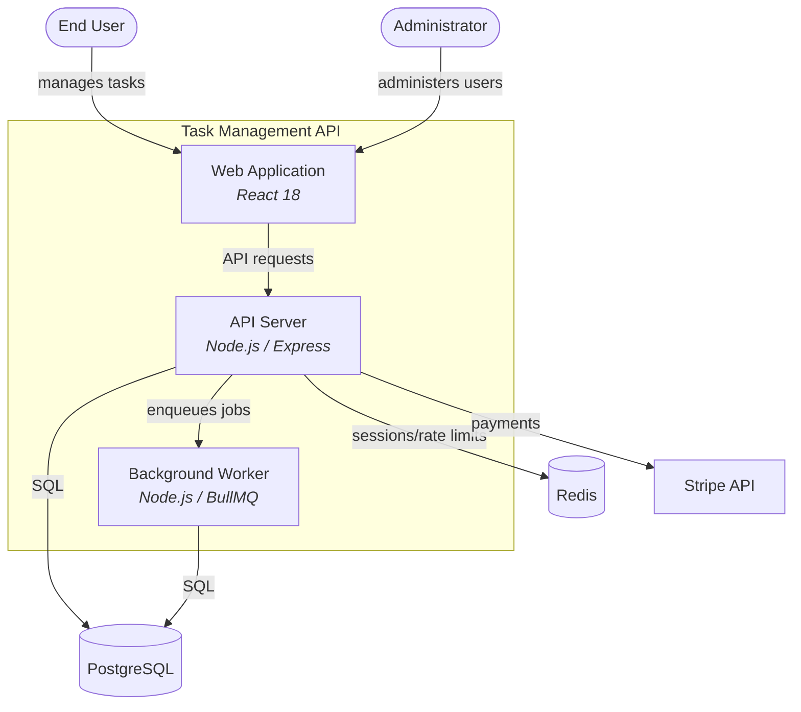

## Purpose

The Container diagram is the C4 Level 2 view. It answers: **what are the
major runtime units and how do they communicate?**

This zooms inside the system boundary to show containers — runtime processes,
not source directories. The API server, the background worker, the web
application, the database, the cache. Edges show communication protocols and
data flow direction.

---

## Mapping Rules

1. **Node IDs.** Convert each entity's `id` from kebab-case to
   UPPER_SNAKE_CASE (same convention as the context diagram).

2. **System boundary subgraph.** Use `system_boundary.name` as the subgraph
   label. All container nodes go inside:
   ```
   subgraph boundary [System Name]
       ...containers...
   end
   ```

3. **Container nodes.** Each entry in `containers` becomes a node inside the
   subgraph with technology annotation:
   ```
   API_SERVER[API Server<br/><i>Node.js / Express</i>]
   ```

4. **External system nodes.** Place outside the subgraph. Same shape rules
   as the context diagram: cylinders for data stores, rectangles for
   everything else.

5. **People nodes.** If `people_container_mappings` exists, add people nodes
   outside the subgraph using stadium shape. Create edges from each person to
   the container they interact with:
   ```
   END_USER([End User]) -->|manages tasks| WEB_APP
   ```
   Use the mapping's `description` as the edge label.

6. **Relationship edges.** Each entry in `relationships` becomes a labeled
   edge using `description` as the label.

7. **Node limit enforcement.** Count all nodes (containers + external_systems
   + people). If over 15, always keep all containers (they're the core of
   this view). Trim external systems and people by relationship count.

---

## Node ID Convention

Same as the context diagram: kebab-case to UPPER_SNAKE_CASE.
- `api-server` → `API_SERVER`
- `background-worker` → `BACKGROUND_WORKER`
- `web-app` → `WEB_APP`

---

## Shape Convention

| Entity Type | Shape | Example |
|-------------|-------|---------|
| Container (inside boundary) | Rectangle with tech | `API_SERVER[API Server<br/><i>Node.js / Express</i>]` |
| Person | Stadium (rounded) | `END_USER([End User])` |
| External system (data store) | Cylinder | `POSTGRESQL[(PostgreSQL)]` |
| External system (other) | Rectangle | `STRIPE_API[Stripe API]` |

Same data store detection as the context diagram — match on `technology` or
`name` containing database/cache keywords.

---

## Example Transformation

**Input** (`.archeia/codebase/architecture/containers.json`):

```json
{
  "system_boundary": {
    "id": "task-api",
    "name": "Task Management API"
  },
  "containers": [
    { "id": "web-app", "name": "Web Application", "technology": "React 18" },
    { "id": "api-server", "name": "API Server", "technology": "Node.js / Express" },
    { "id": "background-worker", "name": "Background Worker", "technology": "Node.js / BullMQ" }
  ],
  "external_systems": [
    { "id": "postgresql", "name": "PostgreSQL" },
    { "id": "redis", "name": "Redis" },
    { "id": "stripe-api", "name": "Stripe API" }
  ],
  "relationships": [
    { "source": "web-app", "target": "api-server", "description": "API requests" },
    { "source": "api-server", "target": "background-worker", "description": "enqueues jobs" },
    { "source": "api-server", "target": "postgresql", "description": "SQL" },
    { "source": "api-server", "target": "redis", "description": "sessions/rate limits" },
    { "source": "api-server", "target": "stripe-api", "description": "payments" },
    { "source": "background-worker", "target": "postgresql", "description": "SQL" }
  ],
  "people_container_mappings": [
    { "person": "end-user", "container": "web-app", "description": "manages tasks" },
    { "person": "admin", "container": "web-app", "description": "administers users" }
  ]
}
```

**Output** (`.archeia/codebase/diagrams/containers.md`):

````markdown
# Container Diagram



**Source:** `.archeia/codebase/architecture/containers.json`
**Generated:** 2025-01-15
````

---

## Quality Rubric

- **TRACEABILITY:** Every container node traces to an entry in `containers`.
  Every external system traces to `external_systems`. Every person traces to
  `people_container_mappings`. Every edge traces to `relationships` or a
  people-container mapping.
- **COMPLETENESS:** All containers appear inside the boundary subgraph. All
  external systems referenced in relationships appear. People appear if
  `people_container_mappings` exists.
- **LABELING:** Every edge has a label. Container nodes include technology
  annotations in italics.
- **LIMITS:** Total node count does not exceed 15. When trimming, all
  containers are kept. External systems and people are ranked by relationship
  count.

---

## Anti-Patterns

- **Placing containers outside the boundary subgraph.** All containers belong
  inside `subgraph boundary [...]`. External systems and people go outside.
- **Listing source directories as containers.** Containers are runtime units
  (processes, databases, caches), not `src/routes/` or `lib/utils/`.
- **Omitting people nodes** when `people_container_mappings` exists. These
  show who interacts with which container directly.
- **Exceeding 15 nodes.** Trim external systems first, then people. Never
  trim containers — they are the point of this diagram.
